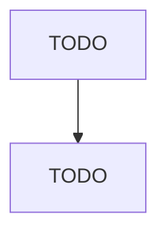

# Search, Detection, Navigation, Guidance, Aeronautical, and Nautical System and Instrument Manufacturing

> TODO: Business-as-Code definition

## Overview

This U.S. industry comprises establishments primarily engaged in manufacturing search, detection, navigation, guidance, aeronautical, and nautical systems and instruments. Examples of products made by these establishments are aircraft instruments (except engine), flight recorders, navigational instruments and systems, radar systems and equipment, and sonar systems and equipment. Cross-References. Establishments primarily engaged in--

## Actors

| Actor | Description |
|-------|-------------|
| TODO | TODO |

## Roles

| Role | Description |
|------|-------------|
| TODO | TODO |

## Entities

| Entity | Description |
|--------|-------------|
| TODO | TODO |

## Actions

| Action | Description |
|--------|-------------|
| TODO | TODO |

## Events

| Event | Description |
|-------|-------------|
| TODO | TODO |

## Searches

| Search | Description |
|--------|-------------|
| TODO | TODO |

## Workflow

## Actor Relationships

