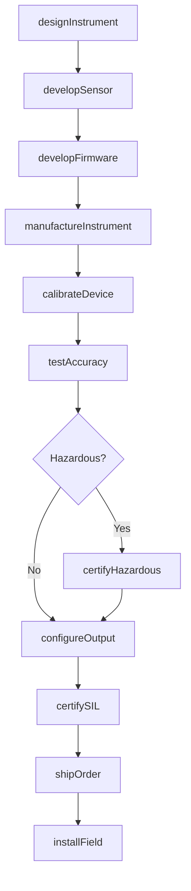
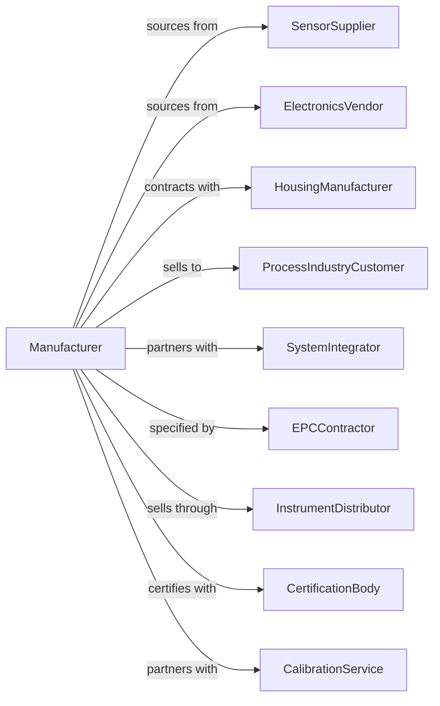

# Instruments and Related Products Manufacturing for Measuring, Displaying, and Controlling Industrial Process Variables

> Business-as-Code definition for industrial instrumentation manufacturing. Models the production of pressure transmitters, flow meters, temperature sensors, and process controllers.

## Overview

This industry manufactures instruments for measuring, displaying, and controlling industrial process variables including temperature, pressure, flow, level, and analytical parameters. Products serve oil and gas, chemical, pharmaceutical, and manufacturing industries. This definition covers sensor technology, hazardous area certification, and integration with DCS and SCADA systems.

## Actors

| Actor | Description |
|-------|-------------|
| SensorSupplier | Provides pressure, temperature, and flow sensing elements |
| ElectronicsVendor | Supplies signal conditioning and communication modules |
| HousingManufacturer | Produces explosion-proof and weatherproof enclosures |
| ProcessIndustryCustomer | Operates refineries, chemical plants, and factories |
| SystemIntegrator | Designs and deploys control system solutions |
| EPC Contractor | Specifies instruments for major capital projects |
| InstrumentDistributor | Stocks and sells instrumentation products |
| CertificationBody | Provides ATEX, IECEx, and SIL certification |
| CalibrationService | Offers traceable calibration and repair |

## Roles

| Role | Description |
|------|-------------|
| InstrumentEngineer | Designs measurement and control instruments |
| SensorEngineer | Develops sensing elements and transducers |
| FirmwareEngineer | Creates embedded software for smart transmitters |
| ApplicationsEngineer | Supports customer selection and installation |
| QualityEngineer | Ensures accuracy and reliability specifications |
| CalibrationTechnician | Performs precision calibration and testing |
| ProductManager | Manages instrument portfolio and market requirements |
| FieldServiceEngineer | Provides installation and commissioning support |

## Entities

| Entity | Description |
|--------|-------------|
| Transmitter | Smart sensor with signal output for control systems |
| FlowMeter | Instrument measuring fluid flow rate |
| PressureGauge | Device indicating pressure level |
| TemperatureSensor | RTD, thermocouple, or infrared temperature device |
| LevelInstrument | Measurement for tank or vessel contents |
| Analyzer | Instrument measuring chemical composition |
| Controller | PID or advanced process controller |
| Recorder | Data logging and trending device |
| Calibration | Traceable adjustment to reference standard |
| Protocol | Communication standard such as HART or Foundation Fieldbus |

## Actions

| Action | Description |
|--------|-------------|
| designInstrument | Create specifications for measurement device |
| developSensor | Engineer sensing element for specific variable |
| developFirmware | Build smart transmitter embedded software |
| manufactureInstrument | Produce instrument assemblies |
| calibrateDevice | Adjust output to traceable reference standard |
| testAccuracy | Validate measurement performance |
| certifyHazardous | Obtain ATEX or IECEx certification |
| certifySIL | Qualify for safety instrumented systems |
| configureOutput | Set communication protocol and parameters |
| shipOrder | Dispatch instruments to customers |
| installField | Deploy and commission at customer site |
| provideService | Deliver calibration and repair services |

## Events

| Event | Description |
|-------|-------------|
| instrumentDesigned | Specifications approved |
| sensorDeveloped | Sensing element qualified |
| firmwareDeveloped | Embedded software completed |
| instrumentManufactured | Production completed |
| deviceCalibrated | Traceable calibration performed |
| accuracyTested | Performance validated |
| hazardousCertified | Explosion-proof approval obtained |
| silCertified | Safety integrity level qualified |
| outputConfigured | Communication settings applied |
| orderShipped | Products dispatched |
| fieldInstalled | Equipment commissioned at site |
| serviceProvided | Calibration or repair completed |

## Searches

| Search | Description |
|--------|-------------|
| findInstruments | List devices by type, range, or protocol |
| getInventory | Check stock levels by part number |
| getOrders | Retrieve orders by customer or project |
| getCertifications | List hazardous area and SIL approvals |
| getCalibrationRecords | Retrieve calibration history |
| findApplications | Match instruments to process requirements |
| getInstalledBase | Track deployed instruments by customer |

## Workflow

## Actor Relationships

