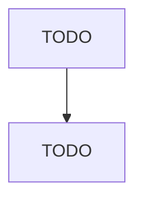

# Instruments and Related Products Manufacturing for Measuring, Displaying, and Controlling Industrial Process Variables

> TODO: Business-as-Code definition

## Overview

This U.S. industry comprises establishments primarily engaged in manufacturing instruments and related devices for measuring, displaying, indicating, recording, transmitting, and controlling industrial process variables. These instruments measure, display, or control (monitor, analyze, and so forth) industrial process variables, such as temperature, humidity, pressure, vacuum, combustion, flow, level, viscosity, density, acidity, concentration, and rotation. Cross-References. Establishments prim

## Actors

| Actor | Description |
|-------|-------------|
| TODO | TODO |

## Roles

| Role | Description |
|------|-------------|
| TODO | TODO |

## Entities

| Entity | Description |
|--------|-------------|
| TODO | TODO |

## Actions

| Action | Description |
|--------|-------------|
| TODO | TODO |

## Events

| Event | Description |
|-------|-------------|
| TODO | TODO |

## Searches

| Search | Description |
|--------|-------------|
| TODO | TODO |

## Workflow

## Actor Relationships

