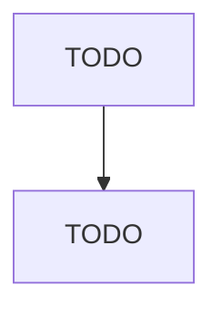

# Instrument Manufacturing for Measuring and Testing Electricity and Electrical Signals

> TODO: Business-as-Code definition

## Overview

This U.S. industry comprises establishments primarily engaged in manufacturing instruments for measuring and testing the characteristics of electricity and electrical signals. Examples of products made by these establishments are circuit and continuity testers, voltmeters, ohm meters, wattmeters, multimeters, and semiconductor test equipment. Cross-References.

## Actors

| Actor | Description |
|-------|-------------|
| TODO | TODO |

## Roles

| Role | Description |
|------|-------------|
| TODO | TODO |

## Entities

| Entity | Description |
|--------|-------------|
| TODO | TODO |

## Actions

| Action | Description |
|--------|-------------|
| TODO | TODO |

## Events

| Event | Description |
|-------|-------------|
| TODO | TODO |

## Searches

| Search | Description |
|--------|-------------|
| TODO | TODO |

## Workflow

## Actor Relationships

