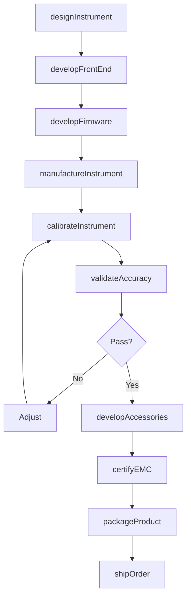
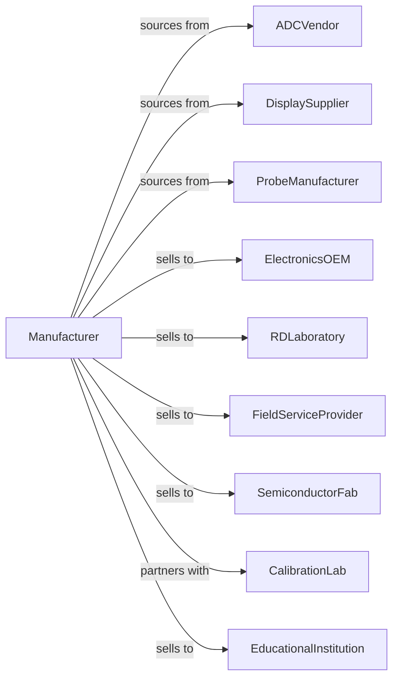

# Instrument Manufacturing for Measuring and Testing Electricity and Electrical Signals

> Business-as-Code definition for electrical test equipment manufacturing. Models the production of multimeters, oscilloscopes, power analyzers, and semiconductor test systems.

## Overview

This industry manufactures instruments for measuring and testing electricity and electrical signals including digital multimeters, oscilloscopes, spectrum analyzers, power meters, and semiconductor test equipment. Products serve electronics manufacturing, R&D laboratories, and field service applications. This definition covers precision measurement technology, calibration standards, and integration with automated test systems.

## Actors

| Actor | Description |
|-------|-------------|
| ADCVendor | Provides high-resolution analog-to-digital converters |
| DisplaySupplier | Supplies LCD and OLED display panels |
| ProbeManufacturer | Produces test probes and accessories |
| ElectronicsOEM | Purchases test equipment for production lines |
| RDLaboratory | Acquires precision measurement instruments |
| FieldServiceProvider | Uses portable test equipment |
| SemiconductorFab | Deploys wafer and chip test systems |
| CalibrationLab | Provides traceable calibration services |
| EducationalInstitution | Purchases equipment for training |

## Roles

| Role | Description |
|------|-------------|
| InstrumentEngineer | Designs test and measurement systems |
| AnalogEngineer | Develops precision front-end circuitry |
| DigitalEngineer | Creates signal processing and display systems |
| SoftwareEngineer | Builds instrument firmware and PC applications |
| QualityEngineer | Ensures measurement accuracy specifications |
| CalibrationEngineer | Develops calibration procedures and standards |
| ApplicationsEngineer | Supports customer measurement applications |
| ProductManager | Manages instrument portfolio |

## Entities

| Entity | Description |
|--------|-------------|
| Multimeter | Instrument measuring voltage, current, and resistance |
| Oscilloscope | Device displaying electrical waveforms |
| SpectrumAnalyzer | Instrument showing frequency domain signals |
| PowerAnalyzer | Device measuring electrical power parameters |
| SignalGenerator | Source producing test signals |
| SemiconductorTester | System testing integrated circuits |
| Probe | Accessory connecting instrument to circuit |
| Calibration | Traceable adjustment to reference standard |
| Specification | Accuracy, bandwidth, and range parameters |
| Software | PC applications for data analysis |

## Actions

| Action | Description |
|--------|-------------|
| designInstrument | Create specifications for test equipment |
| developFrontEnd | Engineer precision analog input circuits |
| developFirmware | Build embedded measurement software |
| manufactureInstrument | Produce test equipment assemblies |
| calibrateInstrument | Adjust to traceable reference standards |
| validateAccuracy | Verify meets published specifications |
| developAccessories | Create probes and adapters |
| certifyEMC | Obtain electromagnetic compatibility approval |
| packageProduct | Prepare with probes, cables, and manual |
| shipOrder | Dispatch to customers |
| provideTraining | Instruct users on measurement techniques |
| offerCalibration | Provide periodic calibration services |

## Events

| Event | Description |
|-------|-------------|
| instrumentDesigned | Specifications approved |
| frontEndDeveloped | Analog circuits qualified |
| firmwareDeveloped | Measurement software completed |
| instrumentManufactured | Production completed |
| instrumentCalibrated | Traceable adjustment performed |
| accuracyValidated | Specifications verified |
| accessoriesDeveloped | Probes and adapters available |
| emcCertified | Compliance approval obtained |
| productPackaged | Ready for shipment |
| orderShipped | Products dispatched |
| trainingProvided | Users instructed |
| calibrationCompleted | Periodic service performed |

## Searches

| Search | Description |
|--------|-------------|
| findInstruments | List equipment by type, bandwidth, or accuracy |
| getInventory | Check stock levels by model |
| getOrders | Retrieve orders by customer or segment |
| getSpecifications | Access detailed product data sheets |
| getCalibrationRecords | Retrieve calibration history by serial number |
| findAccessories | List compatible probes and adapters |
| getApplicationNotes | Access measurement application guides |

## Workflow

## Actor Relationships

