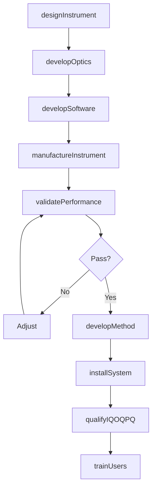
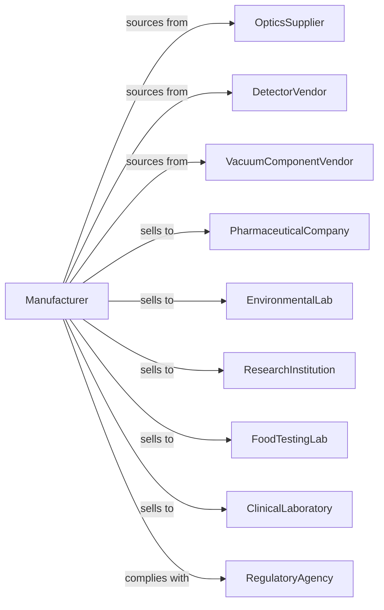

# Analytical Laboratory Instrument Manufacturing

> Business-as-Code definition for analytical instrument manufacturing. Models the production of spectrometers, chromatographs, mass spectrometers, and laboratory analyzers.

## Overview

This industry manufactures analytical instruments for laboratory analysis of chemical and physical composition. Products include mass spectrometers, chromatographs, spectrophotometers, and elemental analyzers serving pharmaceutical, environmental, food safety, and research applications. This definition covers precision optics, detection technology, and software for data analysis and regulatory compliance.

## Actors

| Actor | Description |
|-------|-------------|
| OpticsSupplier | Provides lenses, gratings, and optical components |
| DetectorVendor | Supplies photomultipliers, CCDs, and mass analyzers |
| VacuumComponentVendor | Provides pumps and chambers for mass spec |
| PharmaceuticalCompany | Purchases instruments for drug development and QC |
| EnvironmentalLab | Acquires analyzers for pollution testing |
| ResearchInstitution | Deploys instruments for scientific research |
| FoodTestingLab | Tests food safety and quality |
| ClinicalLaboratory | Performs diagnostic testing |
| RegulatoryAgency | Sets analytical method requirements |

## Roles

| Role | Description |
|------|-------------|
| InstrumentScientist | Designs analytical measurement principles |
| OpticalEngineer | Develops optical systems and detectors |
| MechanicalEngineer | Engineers sample handling and vacuum systems |
| SoftwareEngineer | Creates data acquisition and analysis software |
| ApplicationsScientist | Develops methods and supports customers |
| QualityEngineer | Ensures instrument performance specifications |
| ServiceEngineer | Provides installation and maintenance |
| RegulatorySpecialist | Supports method validation and compliance |

## Entities

| Entity | Description |
|--------|-------------|
| MassSpectrometer | Instrument identifying compounds by mass |
| Chromatograph | System separating mixture components |
| Spectrophotometer | Device measuring light absorption |
| ElementalAnalyzer | Instrument determining elemental composition |
| Detector | Sensor converting signal to measurement |
| SampleHandler | Automated sample introduction system |
| Software | Data acquisition and analysis application |
| Method | Validated analytical procedure |
| Consumable | Columns, vials, and reagents |
| ServiceContract | Maintenance and support agreement |

## Actions

| Action | Description |
|--------|-------------|
| designInstrument | Create analytical system specifications |
| developOptics | Engineer optical and detection systems |
| developSoftware | Build data acquisition and analysis applications |
| manufactureInstrument | Produce analytical equipment |
| validatePerformance | Verify detection limits and accuracy |
| developMethod | Create validated analytical procedures |
| trainUsers | Instruct scientists on instrument operation |
| installSystem | Deploy at customer laboratory |
| qualifyIQOQPQ | Perform installation and operational qualification |
| provideService | Deliver maintenance and repair |
| supplyConsumables | Provide columns, reagents, and parts |
| supportCompliance | Assist with regulatory method validation |

## Events

| Event | Description |
|-------|-------------|
| instrumentDesigned | Specifications approved |
| opticsDeveloped | Optical system qualified |
| softwareDeveloped | Applications completed |
| instrumentManufactured | Production completed |
| performanceValidated | Specifications verified |
| methodDeveloped | Procedure documented and tested |
| usersTrained | Scientists certified |
| systemInstalled | Equipment deployed |
| qualificationCompleted | IQ/OQ/PQ executed |
| serviceProvided | Maintenance performed |
| consumablesSupplied | Supplies delivered |
| complianceSupported | Validation documented |

## Searches

| Search | Description |
|--------|-------------|
| findInstruments | List analyzers by technique or application |
| getInventory | Check stock levels by model |
| getOrders | Retrieve orders by customer or segment |
| getMethods | Access validated analytical procedures |
| getQualificationRecords | Retrieve IQ/OQ/PQ documentation |
| findConsumables | List compatible supplies by instrument |
| getServiceHistory | Track maintenance by serial number |

## Workflow

## Actor Relationships

