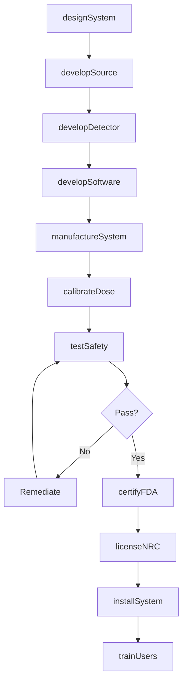
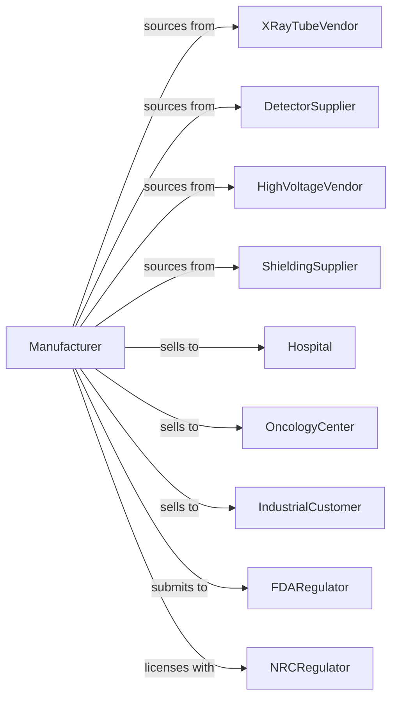

# Irradiation Apparatus Manufacturing

> Business-as-Code definition for irradiation equipment manufacturing. Models the production of X-ray systems, radiation therapy equipment, and industrial irradiation devices.

## Overview

This industry manufactures irradiation apparatus for medical, industrial, and research applications. Products include X-ray tubes, CT scanners, radiation therapy systems, industrial X-ray inspection equipment, and particle accelerators. This definition covers radiation safety, FDA and NRC compliance, and precision dosimetry.

## Actors

| Actor | Description |
|-------|-------------|
| XRayTubeVendor | Provides X-ray generation components |
| DetectorSupplier | Supplies radiation detection and imaging systems |
| HighVoltageVendor | Provides power supplies and accelerator components |
| ShieldingSupplier | Manufactures lead and composite shielding |
| Hospital | Purchases diagnostic and therapy equipment |
| OncologyCenter | Acquires radiation therapy systems |
| IndustrialCustomer | Uses X-ray for NDT and security screening |
| FDARegulator | Approves medical irradiation devices |
| NRCRegulator | Licenses radioactive source equipment |

## Roles

| Role | Description |
|------|-------------|
| RadiationEngineer | Designs X-ray and particle beam systems |
| PhysicsMedicalPhysicist | Develops dosimetry and treatment planning |
| SoftwareEngineer | Creates imaging and control software |
| SafetyEngineer | Ensures radiation protection compliance |
| RegulatorySpecialist | Manages FDA and NRC submissions |
| QualityEngineer | Validates system performance and safety |
| ApplicationsSpecialist | Supports clinical and industrial applications |
| ServiceEngineer | Provides installation and maintenance |

## Entities

| Entity | Description |
|--------|-------------|
| XRaySystem | Diagnostic imaging equipment |
| CTScanner | Computed tomography imaging system |
| LinearAccelerator | Radiation therapy treatment machine |
| XRayTube | Component generating X-ray radiation |
| Detector | Imaging sensor for radiation |
| Shielding | Protective barrier for radiation containment |
| Dosimeter | Device measuring radiation dose |
| TreatmentPlan | Calculated radiation delivery parameters |
| Certification | FDA 510(k), PMA, or NRC license |
| ServiceContract | Maintenance and support agreement |

## Actions

| Action | Description |
|--------|-------------|
| designSystem | Create irradiation equipment specifications |
| developSource | Engineer X-ray tube or accelerator |
| developDetector | Create imaging or measurement detector |
| developSoftware | Build imaging and treatment planning software |
| manufactureSystem | Produce irradiation equipment |
| calibrateDose | Verify radiation output accuracy |
| testSafety | Validate radiation shielding and interlocks |
| certifyFDA | Obtain medical device approval |
| licenseNRC | Secure radioactive material authorization |
| installSystem | Deploy at customer facility |
| trainUsers | Instruct operators on safe use |
| provideService | Deliver maintenance and calibration |

## Events

| Event | Description |
|-------|-------------|
| systemDesigned | Specifications approved |
| sourceDeveloped | X-ray or accelerator qualified |
| detectorDeveloped | Imaging system completed |
| softwareDeveloped | Applications completed |
| systemManufactured | Production completed |
| doseCalibrated | Output verified against standard |
| safetyTested | Shielding and interlocks validated |
| fdaCertified | Medical approval obtained |
| nrcLicensed | Radioactive authorization secured |
| systemInstalled | Equipment deployed |
| usersTrained | Operators certified |
| serviceProvided | Maintenance completed |

## Searches

| Search | Description |
|--------|-------------|
| findSystems | List equipment by type or application |
| getInventory | Check stock levels by model |
| getOrders | Retrieve orders by customer or segment |
| getCertifications | List FDA and NRC approvals |
| getDosimetryRecords | Retrieve calibration data |
| getServiceHistory | Track maintenance by serial number |
| getSafetyReports | Access radiation survey documentation |

## Workflow

## Actor Relationships

