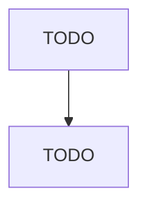

# Other Measuring and Controlling Device Manufacturing

> TODO: Business-as-Code definition

## Overview

This U.S. industry comprises establishments primarily engaged in manufacturing measuring and controlling devices (except search, detection, navigation, guidance, aeronautical, and nautical instruments and systems; automatic environmental controls for residential, commercial, and appliance use; instruments for measurement, display, and control of industrial process variables; totalizing fluid meters and counting devices; instruments for measuring and testing electricity and electrical signals; an

## Actors

| Actor | Description |
|-------|-------------|
| TODO | TODO |

## Roles

| Role | Description |
|------|-------------|
| TODO | TODO |

## Entities

| Entity | Description |
|--------|-------------|
| TODO | TODO |

## Actions

| Action | Description |
|--------|-------------|
| TODO | TODO |

## Events

| Event | Description |
|-------|-------------|
| TODO | TODO |

## Searches

| Search | Description |
|--------|-------------|
| TODO | TODO |

## Workflow

## Actor Relationships

