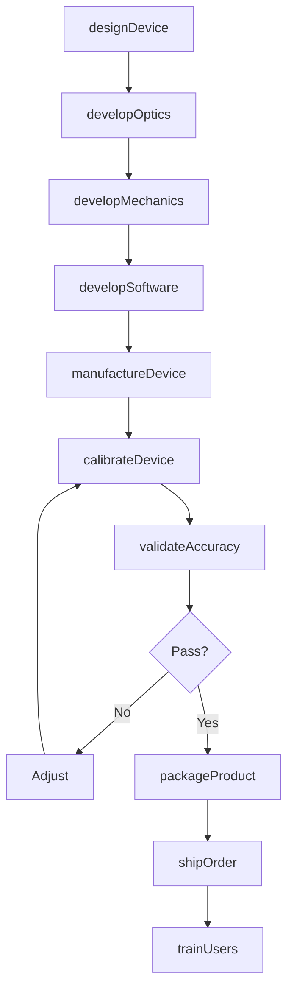
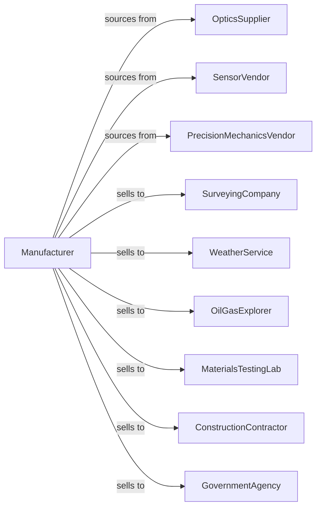

# Other Measuring and Controlling Device Manufacturing

> Business-as-Code definition for specialized measurement device manufacturing. Models the production of surveying instruments, weather stations, seismic equipment, and physical testing devices.

## Overview

This industry manufactures measuring and controlling devices not classified elsewhere, including surveying and drafting instruments, weather and meteorological equipment, seismic monitoring systems, and physical property testing apparatus. This definition covers precision mechanics, sensor integration, and specialized calibration for diverse measurement applications.

## Actors

| Actor | Description |
|-------|-------------|
| OpticsSupplier | Provides lenses and optical components |
| SensorVendor | Supplies accelerometers, barometers, and transducers |
| PrecisionMechanicsVendor | Manufactures gears, bearings, and fine mechanics |
| SurveyingCompany | Purchases theodolites and GPS receivers |
| WeatherService | Acquires meteorological instruments |
| OilGasExplorer | Deploys seismic monitoring equipment |
| MaterialsTestingLab | Uses physical property testing devices |
| ConstructionContractor | Employs surveying and leveling instruments |
| GovernmentAgency | Procures monitoring and measurement systems |

## Roles

| Role | Description |
|------|-------------|
| InstrumentEngineer | Designs specialized measurement devices |
| OpticalEngineer | Develops optical measurement systems |
| MechanicalEngineer | Creates precision mechanical assemblies |
| SoftwareEngineer | Builds data collection and analysis software |
| CalibrationTechnician | Performs precision calibration |
| ApplicationsEngineer | Supports customer measurement needs |
| QualityEngineer | Ensures accuracy and reliability |
| FieldServiceTechnician | Provides installation and repair |

## Entities

| Entity | Description |
|--------|-------------|
| Theodolite | Optical instrument measuring angles |
| TotalStation | Electronic surveying instrument |
| GPSReceiver | Satellite positioning device |
| WeatherStation | Meteorological monitoring system |
| Seismometer | Device detecting ground motion |
| MaterialTester | Equipment measuring physical properties |
| LevelingInstrument | Device establishing horizontal reference |
| DataLogger | Recording device for measurements |
| Calibration | Traceable adjustment to standard |
| Software | Analysis and data management application |

## Actions

| Action | Description |
|--------|-------------|
| designDevice | Create specifications for measurement instrument |
| developOptics | Engineer optical viewing and measuring systems |
| developMechanics | Design precision mechanical assemblies |
| developSoftware | Build data collection and analysis software |
| manufactureDevice | Produce measurement equipment |
| calibrateDevice | Adjust to traceable reference standards |
| validateAccuracy | Verify measurement performance |
| packageProduct | Prepare with accessories and documentation |
| shipOrder | Dispatch to customers |
| trainUsers | Instruct operators on proper use |
| provideService | Deliver repair and calibration services |
| developAccessories | Create supporting equipment and fixtures |

## Events

| Event | Description |
|-------|-------------|
| deviceDesigned | Specifications approved |
| opticsDeveloped | Optical system completed |
| mechanicsDeveloped | Mechanical assembly qualified |
| softwareDeveloped | Data software completed |
| deviceManufactured | Production completed |
| deviceCalibrated | Traceable adjustment performed |
| accuracyValidated | Performance verified |
| productPackaged | Ready for shipment |
| orderShipped | Products dispatched |
| usersTrained | Operators instructed |
| serviceProvided | Maintenance completed |
| accessoriesDeveloped | Supporting equipment available |

## Searches

| Search | Description |
|--------|-------------|
| findDevices | List instruments by type or application |
| getInventory | Check stock levels by model |
| getOrders | Retrieve orders by customer or segment |
| getCalibrationRecords | Retrieve calibration history |
| findAccessories | List compatible supporting equipment |
| getApplicationGuides | Access measurement procedure documentation |
| getServiceHistory | Track maintenance by serial number |

## Workflow

## Actor Relationships

