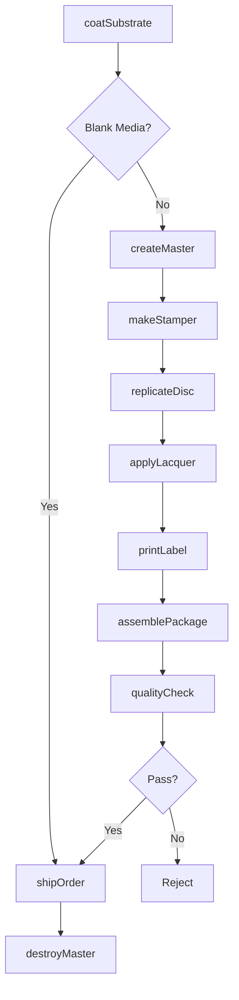
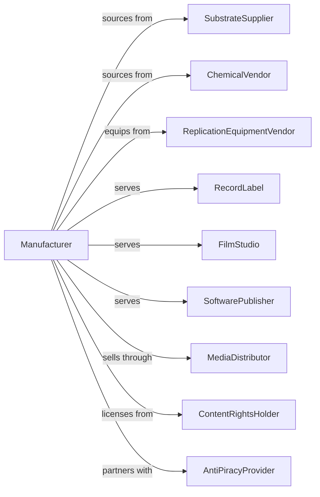

# Manufacturing and Reproducing Magnetic and Optical Media

> Business-as-Code definition for media manufacturing and duplication. Models the production of blank media and mass replication of audio, video, and software content.

## Overview

This industry manufactures blank magnetic and optical media including audio tapes, video tapes, and recordable discs, and also performs mass duplication of pre-recorded content. Products include blank DVDs, Blu-ray discs, USB drives, and replicated software, music, and video media. This definition covers media coating, disc replication, content mastering, and anti-piracy protection.

## Actors

| Actor | Description |
|-------|-------------|
| SubstrateSupplier | Provides polycarbonate and base materials |
| ChemicalVendor | Supplies dyes, magnetic coatings, and lacquers |
| ReplicationEquipmentVendor | Sells disc molding and stamping equipment |
| RecordLabel | Contracts for music CD and vinyl replication |
| FilmStudio | Orders DVD and Blu-ray disc manufacturing |
| SoftwarePublisher | Requires software disc and USB duplication |
| MediaDistributor | Channels replicated media to retail |
| ContentRightsHolder | Licenses content for replication |
| AntiPiracyProvider | Supplies DRM and copy protection technology |

## Roles

| Role | Description |
|------|-------------|
| ProcessEngineer | Develops media coating and replication processes |
| MasteringEngineer | Creates glass masters from content |
| QualityEngineer | Ensures media readability and durability |
| ReplicationOperator | Runs disc molding and stamping equipment |
| PrintOperator | Applies disc labels and packaging printing |
| PackagingTechnician | Assembles finished media products |
| ProductionPlanner | Schedules replication orders and capacity |
| RightsCoordinator | Manages content licensing and compliance |

## Entities

| Entity | Description |
|--------|-------------|
| BlankMedia | Unrecorded disc, tape, or flash media |
| MasterDisc | Glass master for replication |
| Stamper | Metal die for molding discs |
| ReplicatedDisc | Mass-produced CD, DVD, or Blu-ray |
| USBDrive | Flash media with duplicated content |
| Coating | Magnetic or dye layer for recording |
| Packaging | Jewel case, sleeve, or box |
| ContentLicense | Authorization to replicate material |
| CopyProtection | DRM or encryption technology |
| PrintMaterial | Labels, inserts, and artwork |

## Actions

| Action | Description |
|--------|-------------|
| coatSubstrate | Apply magnetic or optical recording layer |
| createMaster | Produce glass master from content data |
| makeStamper | Electroform metal stamper from master |
| replicateDisc | Mold discs from stamper |
| applyLacquer | Add protective layer to disc surface |
| printLabel | Apply graphics to disc and packaging |
| duplicateUSB | Copy content to flash drives |
| assemblePackage | Combine disc, insert, and case |
| qualityCheck | Verify media playback and appearance |
| shipOrder | Dispatch finished products |
| destroyMaster | Securely dispose of master after run |
| archiveContent | Store content for future replication |

## Events

| Event | Description |
|-------|-------------|
| substrateCoated | Recording layer applied |
| masterCreated | Glass master produced |
| stamperMade | Metal die completed |
| discReplicated | Disc molding completed |
| lacquerApplied | Protective coating added |
| labelPrinted | Graphics applied |
| usbDuplicated | Flash content copied |
| packageAssembled | Finished product ready |
| qualityPassed | Media validated |
| orderShipped | Products dispatched |
| masterDestroyed | Content security maintained |
| contentArchived | Material preserved |

## Searches

| Search | Description |
|--------|-------------|
| findProducts | List media by type or format |
| getOrders | Retrieve replication orders by customer |
| getInventory | Check blank and finished media stock |
| findMasters | List glass masters and stampers |
| getQualityData | Retrieve error rate and test results |
| getLicenses | Track content authorizations |
| getCapacity | View replication line availability |

## Workflow

## Actor Relationships

