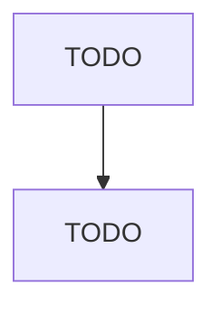

# Residential Electric Lighting Fixture Manufacturing

> TODO: Business-as-Code definition

## Overview

This U.S. industry comprises establishments primarily engaged in manufacturing fixed or portable residential electric lighting fixtures and lamp shades of metal, paper, or textiles. Residential electric lighting fixtures include those for use both inside and outside the residence. Illustrative Examples: Ceiling lighting fixtures, residential, manufacturing Chandeliers, residential, manufacturing Table lamps (i.e., lighting fixtures) manufacturing Cross-References. Establishments primarily engage

## Actors

| Actor | Description |
|-------|-------------|
| TODO | TODO |

## Roles

| Role | Description |
|------|-------------|
| TODO | TODO |

## Entities

| Entity | Description |
|--------|-------------|
| TODO | TODO |

## Actions

| Action | Description |
|--------|-------------|
| TODO | TODO |

## Events

| Event | Description |
|-------|-------------|
| TODO | TODO |

## Searches

| Search | Description |
|--------|-------------|
| TODO | TODO |

## Workflow

## Actor Relationships

