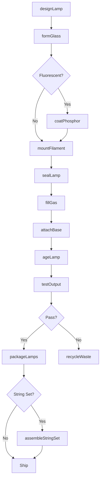
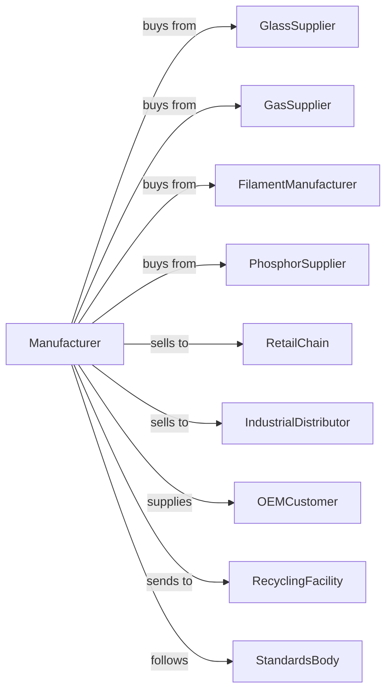

# Electric Lamp Bulb and Other Lighting Equipment Manufacturing

> Business-as-Code definition for electric lamp bulb and specialty lighting equipment production. Models the complete manufacturing lifecycle from component sourcing through distribution of light sources and specialty equipment.

## Overview

This U.S. industry comprises establishments primarily engaged in manufacturing electric light bulbs, tubes, and parts (except glass blanks for electric light bulbs and light emitting diodes (LEDs)), electric lighting fixtures (except residential, commercial, industrial, institutional, and vehicular electric lighting fixtures), and nonelectric lighting equipment. Illustrative Examples: Christmas tree lighting sets, electric, manufacturing Electric light bulbs, complete, manufacturing Fireplace logs, electric, manufacturing Flashlights manufacturing.

## Actors

| Actor | Description |
|-------|-------------|
| GlassSupplier | Provides glass tubes, bulbs, and envelopes |
| GasSupplier | Supplies inert gases for lamp filling |
| FilamentManufacturer | Produces tungsten and specialty filaments |
| PhosphorSupplier | Provides fluorescent coating materials |
| RetailChain | Mass-market retailers selling consumer bulbs |
| IndustrialDistributor | Supplies specialty lamps to businesses |
| OEMCustomer | Integrates lamps into equipment and products |
| RecyclingFacility | Processes end-of-life lamps and materials |
| ImportExporter | Handles international trade logistics |
| StandardsBody | Develops lamp specifications and standards |

## Roles

| Role | Description |
|------|-------------|
| LampEngineer | Designs lamp specifications and performance |
| GlassworkerOperator | Forms and seals glass lamp components |
| FilamentAssembler | Mounts and welds filament assemblies |
| VacuumTechnician | Evacuates and fills lamps with gas |
| QualityTester | Performs photometric and life testing |
| PackagingOperator | Prepares lamps for retail and bulk shipment |
| ProductionManager | Oversees lamp manufacturing operations |

## Entities

| Entity | Description |
|--------|-------------|
| LampBulb | Complete light source unit |
| GlassEnvelope | Sealed glass container for lamp elements |
| Filament | Tungsten wire that produces light when heated |
| Phosphor | Fluorescent coating converting UV to visible light |
| Base | Standardized electrical connection (E26, E12, etc.) |
| InertGas | Argon, nitrogen, or other fill gas |
| ChristmasLightSet | Decorative lighting string with multiple bulbs |
| Flashlight | Portable battery-powered lighting device |
| SpecialtyLamp | Application-specific light source |
| LifeRating | Expected operating hours for lamp |

## Actions

| Action | Description |
|--------|-------------|
| designLamp | Specify electrical and photometric characteristics |
| formGlass | Shape glass tubes and bulb envelopes |
| coatPhosphor | Apply fluorescent coating to glass |
| mountFilament | Assemble and weld filament support structure |
| sealLamp | Close glass envelope and create vacuum seal |
| fillGas | Evacuate and fill lamp with inert gas |
| attachBase | Cement electrical base to lamp |
| ageLamp | Operate lamp to stabilize initial performance |
| testOutput | Measure lumens, color temperature, and efficacy |
| testLife | Perform accelerated life cycle testing |
| packageLamps | Pack lamps for retail or industrial shipment |
| assembleStringSet | Wire multiple lamps into decorative sets |
| recycleWaste | Process manufacturing scrap and defects |
| manageHazmat | Handle mercury and other hazardous materials |

## Events

| Event | Description |
|-------|-------------|
| lampDesigned | Specifications have been approved |
| glassFormed | Envelope has been shaped and annealed |
| phosphorCoated | Fluorescent coating has been applied |
| filamentMounted | Light-producing element is installed |
| lampSealed | Glass envelope has been closed |
| gasFilled | Lamp has been evacuated and filled |
| baseAttached | Electrical connection has been added |
| lampAged | Initial burn-in is complete |
| outputTested | Photometric performance verified |
| lifeTested | Durability testing completed |
| lampsPackaged | Product is ready for shipment |
| stringSetAssembled | Multi-lamp product is complete |

## Searches

| Search | Description |
|--------|-------------|
| findLamps | Search by wattage, base type, or application |
| getInventory | Check stock levels by lamp type |
| findSuppliers | List vendors for glass, gas, or components |
| getTestResults | Retrieve photometric and life test data |
| findOrders | Search orders by customer or product line |
| getProductionSchedule | View manufacturing queue and capacity |
| findSpecialtyLamps | Locate lamps for specific applications |
| getRecyclingStatus | Track hazardous waste processing |

## Workflow

## Actor Relationships

