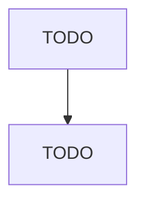

# Electric Lamp Bulb and Other Lighting Equipment Manufacturing

> TODO: Business-as-Code definition

## Overview

This U.S. industry comprises establishments primarily engaged in manufacturing electric light bulbs, tubes, and parts (except glass blanks for electric light bulbs and light emitting diodes (LEDs)), electric lighting fixtures (except residential, commercial, industrial, institutional, and vehicular electric lighting fixtures), and nonelectric lighting equipment. Illustrative Examples: Christmas tree lighting sets, electric, manufacturing Electric light bulbs, complete, manufacturing Fireplace lo

## Actors

| Actor | Description |
|-------|-------------|
| TODO | TODO |

## Roles

| Role | Description |
|------|-------------|
| TODO | TODO |

## Entities

| Entity | Description |
|--------|-------------|
| TODO | TODO |

## Actions

| Action | Description |
|--------|-------------|
| TODO | TODO |

## Events

| Event | Description |
|-------|-------------|
| TODO | TODO |

## Searches

| Search | Description |
|--------|-------------|
| TODO | TODO |

## Workflow

## Actor Relationships

