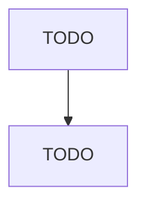

# Small Electrical Appliance Manufacturing

> TODO: Business-as-Code definition

## Overview

This industry comprises establishments primarily engaged in manufacturing small electric appliances and electric housewares, household-type fans (except attic fans), household-type vacuum cleaners, and other electric household-type floor care machines. Illustrative Examples: Bath fans, residential, manufacturing Carpet and floor cleaning equipment, household-type electric, manufacturing Ceiling fans, residential, manufacturing Curling irons, household-type electric, manufacturing Electric blanke

## Actors

| Actor | Description |
|-------|-------------|
| TODO | TODO |

## Roles

| Role | Description |
|------|-------------|
| TODO | TODO |

## Entities

| Entity | Description |
|--------|-------------|
| TODO | TODO |

## Actions

| Action | Description |
|--------|-------------|
| TODO | TODO |

## Events

| Event | Description |
|-------|-------------|
| TODO | TODO |

## Searches

| Search | Description |
|--------|-------------|
| TODO | TODO |

## Workflow

## Actor Relationships

