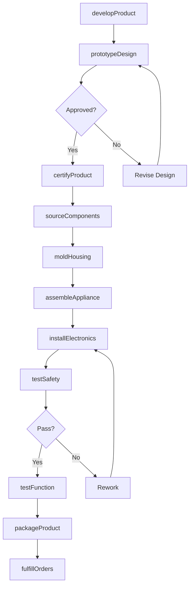
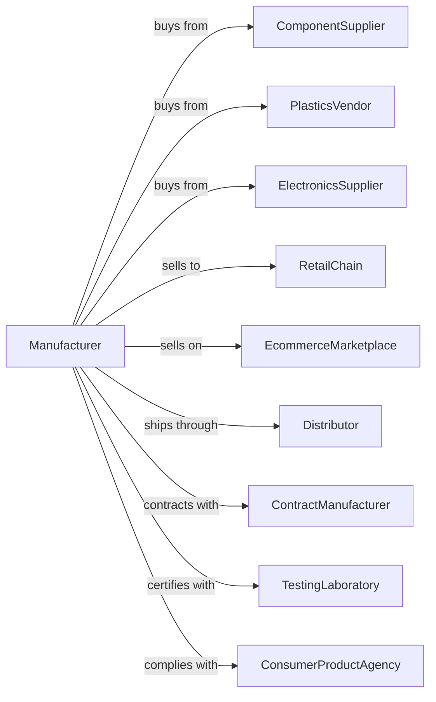

# Small Electrical Appliance Manufacturing

> Business-as-Code definition for small electrical appliance production operations. Models the complete manufacturing lifecycle from product development through consumer distribution.

## Overview

This industry comprises establishments primarily engaged in manufacturing small electric appliances and electric housewares, household-type fans (except attic fans), household-type vacuum cleaners, and other electric household-type floor care machines. Illustrative Examples: Bath fans, residential, manufacturing Carpet and floor cleaning equipment, household-type electric, manufacturing Ceiling fans, residential, manufacturing Curling irons, household-type electric, manufacturing Electric blankets manufacturing Coffee makers, household-type electric, manufacturing Toasters manufacturing.

## Actors

| Actor | Description |
|-------|-------------|
| ComponentSupplier | Provides motors, heating elements, and electronics |
| PlasticsVendor | Supplies housings and injection-molded parts |
| ElectronicsSupplier | Provides control boards and digital displays |
| RetailChain | Mass-market retailers selling consumer appliances |
| EcommerceMarketplace | Online platforms for direct consumer sales |
| Distributor | Wholesale distribution to retail channels |
| ContractManufacturer | Offshore production partner |
| TestingLaboratory | Provides UL, ETL, and safety certifications |
| ConsumerProductAgency | Regulates product safety standards |
| WarrantyServiceProvider | Handles repairs and replacements |

## Roles

| Role | Description |
|------|-------------|
| ProductDesigner | Creates appliance concepts and specifications |
| MechanicalEngineer | Designs internal mechanisms and assemblies |
| ElectricalEngineer | Develops circuits and control systems |
| IndustrialDesigner | Creates aesthetic and ergonomic exteriors |
| QualityEngineer | Establishes testing protocols and standards |
| AssemblyLineWorker | Assembles components into finished products |
| PackagingDesigner | Creates retail packaging and displays |

## Entities

| Entity | Description |
|--------|-------------|
| Appliance | Complete consumer product unit |
| Motor | Electric motor providing mechanical power |
| HeatingElement | Resistive element for heat-producing appliances |
| ControlBoard | Electronic circuit managing appliance functions |
| Housing | Exterior enclosure and structural components |
| PowerCord | Electrical connection to wall outlet |
| UserInterface | Buttons, displays, and controls |
| SafetyDevice | Thermal cutoff or overload protection |
| PackagedProduct | Retail-ready boxed appliance |
| ModelNumber | Unique product identification |

## Actions

| Action | Description |
|--------|-------------|
| developProduct | Create new appliance concept and specifications |
| prototypeDesign | Build and test functional prototypes |
| sourceComponents | Procure motors, electronics, and materials |
| moldHousing | Injection mold plastic enclosure parts |
| assembleAppliance | Build complete unit from components |
| installElectronics | Mount control boards and wire connections |
| testSafety | Perform electrical and thermal safety tests |
| testFunction | Verify appliance operates to specifications |
| certifyProduct | Obtain UL, ETL, or other safety listings |
| designPackaging | Create retail box and documentation |
| packageProduct | Prepare appliance for retail distribution |
| fulfillOrders | Ship products to retailers and distributors |
| processWarranty | Handle customer service and replacements |
| conductRecall | Execute product recall if safety issue found |

## Events

| Event | Description |
|-------|-------------|
| productDeveloped | New appliance design has been approved |
| prototypeCompleted | Functional prototype is ready for testing |
| componentsReceived | Parts have arrived at manufacturing facility |
| housingMolded | Plastic parts are ready for assembly |
| applianceAssembled | Unit has been fully built |
| electronicsInstalled | Control systems are connected |
| safetyTested | Product has passed safety testing |
| functionVerified | Appliance operates correctly |
| productCertified | Safety certification has been obtained |
| packagingDesigned | Retail packaging is approved |
| productPackaged | Appliance is ready for shipment |
| ordersFulfilled | Retail shipments have been completed |
| warrantyProcessed | Customer claim has been resolved |
| recallInitiated | Safety recall has been announced |

## Searches

| Search | Description |
|--------|-------------|
| findProducts | Search appliances by category or features |
| getInventory | Check stock levels by model and warehouse |
| findComponents | Locate available parts by specification |
| getOrders | Retrieve orders by retailer or status |
| findCertifications | List products by certification status |
| getSalesData | View sales by product line or channel |
| getWarrantyClaims | Review service requests by product |
| findSuppliers | List vendors by component type |

## Workflow

## Actor Relationships

