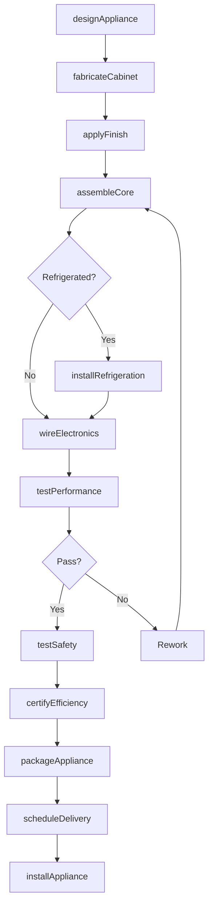
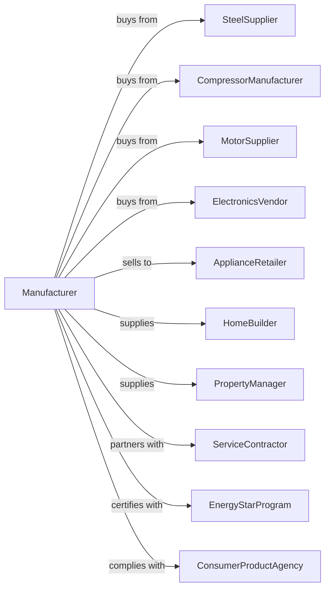

# Major Household Appliance Manufacturing

> Business-as-Code definition for major household appliance production operations. Models the complete manufacturing lifecycle from engineering through installation and service.

## Overview

This industry comprises establishments primarily engaged in manufacturing household-type cooking appliances, household-type laundry equipment, household-type refrigerators, upright and chest freezers, and other electrical and nonelectrical major household-type appliances, such as dishwashers, water heaters, and garbage disposal units.

## Actors

| Actor | Description |
|-------|-------------|
| SteelSupplier | Provides sheet steel for cabinets and frames |
| CompressorManufacturer | Supplies refrigeration compressors |
| MotorSupplier | Provides electric motors for various functions |
| ElectronicsVendor | Supplies control boards and sensors |
| ApplianceRetailer | Sells appliances to consumers |
| HomeBuilder | Purchases appliances for new construction |
| PropertyManager | Buys appliances for rental properties |
| ServiceContractor | Provides installation and repair services |
| EnergyStarProgram | Certifies energy efficiency compliance |
| ConsumerProductAgency | Regulates safety and energy standards |

## Roles

| Role | Description |
|------|-------------|
| ProductEngineer | Designs appliance systems and components |
| RefrigerationEngineer | Specializes in cooling system design |
| ManufacturingEngineer | Develops production processes and tooling |
| AssemblyLineSupervisor | Manages production line operations |
| QualityTechnician | Tests appliances for performance and safety |
| ServiceTrainer | Develops technician training programs |
| SupplyChainManager | Coordinates parts procurement and logistics |

## Entities

| Entity | Description |
|--------|-------------|
| Appliance | Complete major household unit |
| Cabinet | Outer shell and structural frame |
| Compressor | Refrigeration system pump |
| Motor | Electric motor for drums, fans, or pumps |
| ControlSystem | Electronic controls and user interface |
| Insulation | Thermal barrier for refrigerated units |
| Drum | Rotating container in washers and dryers |
| HeatingElement | Electric element for cooking or drying |
| RefrigerantCharge | Cooling system fluid |
| EnergyLabel | Efficiency rating and usage information |

## Actions

| Action | Description |
|--------|-------------|
| designAppliance | Engineer new product specifications |
| fabricateCabinet | Form and weld steel enclosures |
| applyFinish | Paint or apply surface coatings |
| assembleCore | Build internal mechanical systems |
| installRefrigeration | Braze lines and charge refrigerant |
| wireElectronics | Connect control boards and sensors |
| testPerformance | Verify appliance meets specifications |
| testSafety | Perform electrical and mechanical safety tests |
| certifyEfficiency | Obtain ENERGY STAR certification |
| packageAppliance | Prepare unit for shipping and delivery |
| scheduleDelivery | Coordinate delivery to customer |
| installAppliance | Set up and connect at customer location |
| serviceAppliance | Diagnose and repair issues |
| processRebate | Handle utility and manufacturer rebates |

## Events

| Event | Description |
|-------|-------------|
| applianceDesigned | Engineering specifications approved |
| cabinetFabricated | Steel enclosure is complete |
| finishApplied | Surface coating has cured |
| coreAssembled | Internal systems are installed |
| refrigerationCharged | Cooling system is operational |
| electronicsWired | Controls are connected and programmed |
| performanceTested | Unit meets output specifications |
| safetyVerified | Appliance has passed safety testing |
| efficiencyCertified | ENERGY STAR rating obtained |
| appliancePackaged | Unit is ready for shipment |
| deliveryScheduled | Customer delivery date confirmed |
| applianceInstalled | Unit is set up at customer site |
| applianceServiced | Repair or maintenance completed |
| rebateProcessed | Incentive payment issued |

## Searches

| Search | Description |
|--------|-------------|
| findAppliances | Search by type, capacity, or features |
| getInventory | Check stock by model and distribution center |
| findOrders | Retrieve orders by customer or retailer |
| getProductionSchedule | View assembly line schedule |
| findServiceCalls | List open service requests by region |
| getWarrantyStatus | Check coverage for specific serial numbers |
| findRebates | List available efficiency incentives |
| getEnergyRatings | Retrieve efficiency data by model |

## Workflow

## Actor Relationships

