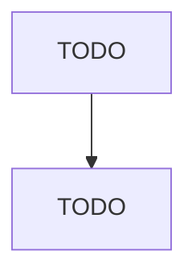

# Power, Distribution, and Specialty Transformer Manufacturing

> TODO: Business-as-Code definition

## Overview

This U.S. industry comprises establishments primarily engaged in manufacturing power, distribution, and specialty transformers (except electronic components). Industrial-type and consumer-type transformers in this industry vary (e.g., step up or step down) voltage but do not convert alternating to direct or direct to alternating current. Illustrative Examples: Fluorescent ballasts (i.e., transformers) manufacturing Substation transformers, electric power distribution, manufacturing Distribution 

## Actors

| Actor | Description |
|-------|-------------|
| TODO | TODO |

## Roles

| Role | Description |
|------|-------------|
| TODO | TODO |

## Entities

| Entity | Description |
|--------|-------------|
| TODO | TODO |

## Actions

| Action | Description |
|--------|-------------|
| TODO | TODO |

## Events

| Event | Description |
|-------|-------------|
| TODO | TODO |

## Searches

| Search | Description |
|--------|-------------|
| TODO | TODO |

## Workflow

## Actor Relationships

