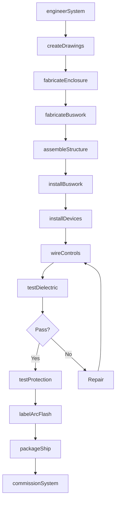
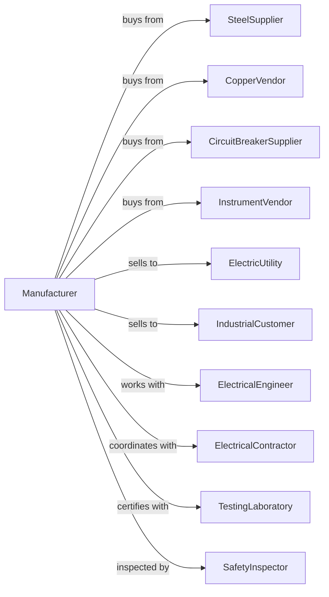

# Switchgear and Switchboard Apparatus Manufacturing

> Business-as-Code definition for switchgear and switchboard apparatus production. Models the complete manufacturing lifecycle from engineering through commissioning and maintenance.

## Overview

This U.S. industry comprises establishments primarily engaged in manufacturing switchgear and switchboard apparatus. Illustrative Examples: Circuit breakers, power, manufacturing Control panels, electric power distribution, manufacturing Ducts for electrical switchboard apparatus manufacturing Fuses, electric, manufacturing Power switching equipment manufacturing Switches, electric power (except pushbutton, snap, solenoid, tumbler), manufacturing.

## Actors

| Actor | Description |
|-------|-------------|
| SteelSupplier | Provides sheet steel for enclosures |
| CopperVendor | Supplies bus bars and conductors |
| CircuitBreakerSupplier | Provides breakers and protective devices |
| InstrumentVendor | Supplies meters and monitoring equipment |
| ElectricUtility | Purchases switchgear for substations |
| IndustrialCustomer | Buys switchboards for facility power |
| ElectricalEngineer | Specifies equipment for projects |
| ElectricalContractor | Installs and connects equipment |
| TestingLaboratory | Provides UL and IEEE certifications |
| SafetyInspector | Verifies code compliance |

## Roles

| Role | Description |
|------|-------------|
| DesignEngineer | Creates electrical schematics and layouts |
| MechanicalEngineer | Designs enclosures and structural components |
| SheetMetalFabricator | Builds enclosures and mounting structures |
| BusbarAssembler | Fabricates and installs copper bus systems |
| WiringTechnician | Connects control circuits and instruments |
| TestEngineer | Performs factory acceptance testing |
| FieldCommissioner | Starts up and verifies equipment on site |

## Entities

| Entity | Description |
|--------|-------------|
| Switchgear | Metal-enclosed power switching assembly |
| Switchboard | Free-standing power distribution panel |
| CircuitBreaker | Protective device interrupting fault current |
| BusBar | Copper conductor distributing power |
| Enclosure | Metal housing providing protection |
| ControlPanel | Assembly of switches and indicators |
| Fuse | Overcurrent protection device |
| MeteringCompartment | Section housing meters and instruments |
| ArcFlashLabel | Safety warning with incident energy data |
| OneLineDrawing | Electrical schematic showing connections |

## Actions

| Action | Description |
|--------|-------------|
| engineerSystem | Create electrical design and specifications |
| createDrawings | Produce fabrication and wiring drawings |
| fabricateEnclosure | Build steel housing and structure |
| fabricateBuswork | Form and drill copper bus bars |
| assembleStructure | Mount enclosures and internal supports |
| installBuswork | Connect bus bars and main conductors |
| installDevices | Mount circuit breakers and fuses |
| wireControls | Connect control and metering circuits |
| testDielectric | Perform high-voltage insulation tests |
| testProtection | Verify relay and breaker coordination |
| labelArcFlash | Calculate and apply safety labels |
| packageShip | Prepare equipment for transport |
| commissionSystem | Energize and verify at customer site |
| performMaintenance | Conduct periodic testing and inspection |

## Events

| Event | Description |
|-------|-------------|
| systemEngineered | Design has been approved |
| drawingsCreated | Fabrication documentation complete |
| enclosureFabricated | Steel structure is ready |
| busworkFabricated | Bus bars are formed and drilled |
| structureAssembled | Equipment frame is built |
| busworkInstalled | Main conductors connected |
| devicesInstalled | Breakers and fuses mounted |
| controlsWired | Control circuits complete |
| dielectricTested | Insulation verified |
| protectionTested | Protective coordination confirmed |
| arcFlashLabeled | Safety labels applied |
| equipmentShipped | Units dispatched to site |
| systemCommissioned | Equipment energized and operational |
| maintenanceCompleted | Service inspection finished |

## Searches

| Search | Description |
|--------|-------------|
| findEquipment | Search by voltage class, amperage, or type |
| getOrders | Retrieve orders by customer or project |
| getDrawings | Access engineering documents by job number |
| findComponents | Locate available breakers or devices |
| getTestReports | Retrieve factory test documentation |
| findProjects | List active jobs by status or region |
| getMaintenanceSchedule | View upcoming service requirements |
| findCertifications | List equipment by UL or IEEE listing |

## Workflow

## Actor Relationships

