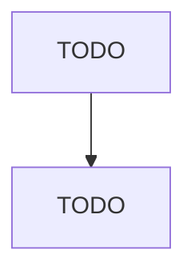

# Switchgear and Switchboard Apparatus Manufacturing

> TODO: Business-as-Code definition

## Overview

This U.S. industry comprises establishments primarily engaged in manufacturing switchgear and switchboard apparatus. Illustrative Examples: Circuit breakers, power, manufacturing Control panels, electric power distribution, manufacturing Ducts for electrical switchboard apparatus manufacturing Fuses, electric, manufacturing Power switching equipment manufacturing Switches, electric power (except pushbutton, snap, solenoid, tumbler), manufacturing Cross-References. Establishments primarily engage

## Actors

| Actor | Description |
|-------|-------------|
| TODO | TODO |

## Roles

| Role | Description |
|------|-------------|
| TODO | TODO |

## Entities

| Entity | Description |
|--------|-------------|
| TODO | TODO |

## Actions

| Action | Description |
|--------|-------------|
| TODO | TODO |

## Events

| Event | Description |
|-------|-------------|
| TODO | TODO |

## Searches

| Search | Description |
|--------|-------------|
| TODO | TODO |

## Workflow

## Actor Relationships

