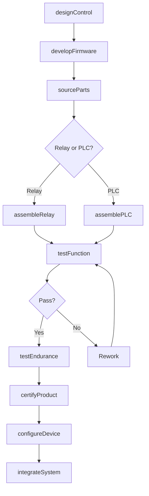
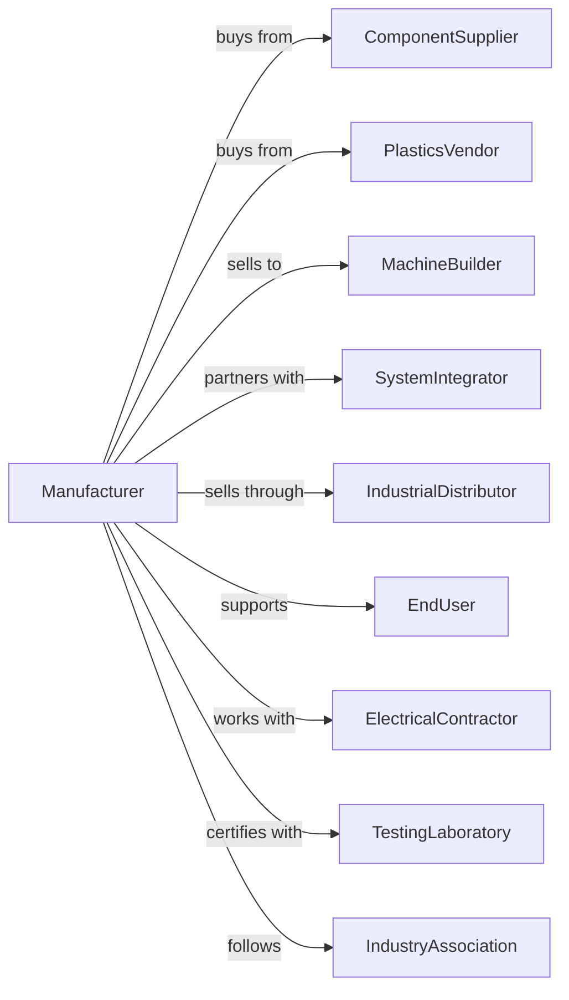

# Relay and Industrial Control Manufacturing

> Business-as-Code definition for relay and industrial control production operations. Models the complete manufacturing lifecycle from design through integration and support.

## Overview

This U.S. industry comprises establishments primarily engaged in manufacturing relays, motor starters and controllers, and other industrial controls and control accessories. Products include electromagnetic relays, programmable logic controllers, motor control centers, and automation components for industrial machinery and processes.

## Actors

| Actor | Description |
|-------|-------------|
| ComponentSupplier | Provides semiconductors, contacts, and coils |
| PlasticsVendor | Supplies housings and enclosures |
| MachineBuilder | Integrates controls into equipment |
| SystemIntegrator | Designs and programs control systems |
| IndustrialDistributor | Sells controls through wholesale channels |
| EndUser | Operates equipment using controls |
| ElectricalContractor | Installs controls in facilities |
| TestingLaboratory | Provides UL and CE certifications |
| IndustryAssociation | Sets standards for control protocols |
| TechnicalTrainer | Delivers product training programs |

## Roles

| Role | Description |
|------|-------------|
| ControlsEngineer | Designs relay and controller specifications |
| ElectronicsEngineer | Develops circuit boards and firmware |
| ApplicationEngineer | Provides technical support and integration |
| ProductionTechnician | Assembles and tests control products |
| QualityInspector | Verifies product performance and safety |
| TechnicalWriter | Creates manuals and programming guides |
| FieldSupport | Assists customers with installation and troubleshooting |

## Entities

| Entity | Description |
|--------|-------------|
| Relay | Electromagnetic or solid-state switching device |
| MotorStarter | Device for starting and protecting motors |
| PLC | Programmable logic controller for automation |
| Contactor | Heavy-duty switching device for power circuits |
| TimerRelay | Relay with time-delay functions |
| OverloadRelay | Motor protection device sensing current |
| ControlPanel | Enclosure housing multiple control devices |
| IOModule | Input/output interface for PLC systems |
| HMI | Human-machine interface display |
| Protocol | Communication standard for device networking |

## Actions

| Action | Description |
|--------|-------------|
| designControl | Create electrical and functional specifications |
| developFirmware | Write embedded software for controllers |
| sourceParts | Procure components and materials |
| assembleRelay | Build relay units from components |
| assemblePLC | Manufacture programmable controllers |
| testFunction | Verify device operates to specifications |
| testEndurance | Perform cycle life and durability testing |
| certifyProduct | Obtain safety and compliance certifications |
| configureDevice | Program settings for customer applications |
| integrateSystem | Combine controls into complete solutions |
| provideTraining | Deliver technical education to users |
| supportApplication | Assist with troubleshooting and optimization |
| updateFirmware | Release software updates for controllers |
| processRMA | Handle product returns and replacements |

## Events

| Event | Description |
|-------|-------------|
| controlDesigned | Specifications have been approved |
| firmwareDeveloped | Embedded software is ready |
| partsReceived | Components have arrived at facility |
| relayAssembled | Switching device is complete |
| plcAssembled | Controller is manufactured |
| functionTested | Device operation verified |
| enduranceTested | Life cycle testing complete |
| productCertified | Safety certifications obtained |
| deviceConfigured | Customer programming complete |
| systemIntegrated | Control solution delivered |
| trainingCompleted | User education session finished |
| firmwareUpdated | New software version released |
| rmaProcessed | Return has been resolved |

## Searches

| Search | Description |
|--------|-------------|
| findRelays | Search by coil voltage, contact rating, or type |
| findPLCs | Search by IO count, protocol, or form factor |
| findStarters | Search by motor horsepower or enclosure type |
| getInventory | Check stock by product and location |
| findOrders | Retrieve orders by customer or product line |
| getCertifications | List products by certification status |
| findApplications | Search by industry or use case |
| getTechnicalDocs | Access manuals and programming guides |

## Workflow

## Actor Relationships

