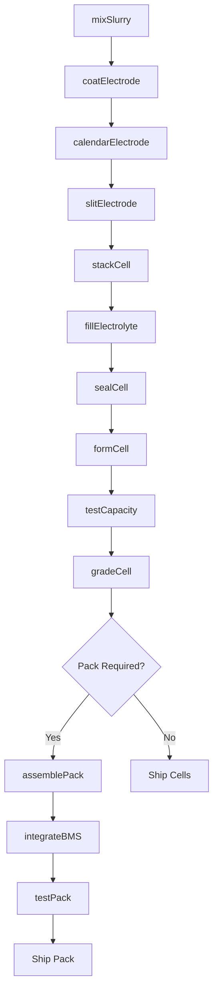
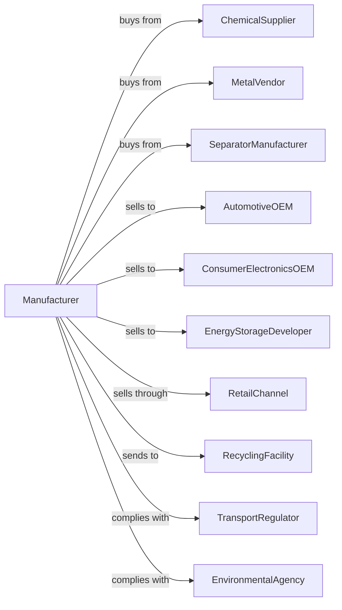

# Battery Manufacturing

> Business-as-Code definition for battery production operations. Models the complete manufacturing lifecycle from cell production through recycling and second-life applications.

## Overview

This industry comprises establishments primarily engaged in manufacturing primary and storage batteries. Illustrative Examples: Disposable flashlight batteries manufacturing Dry cells, primary (e.g., AAA, AA, C, D, 9V), manufacturing Lead acid storage batteries manufacturing Lithium batteries manufacturing Rechargeable nickel-cadmium (NICAD) batteries manufacturing Watch batteries manufacturing.

## Actors

| Actor | Description |
|-------|-------------|
| ChemicalSupplier | Provides lithium, cobalt, nickel, and electrolytes |
| MetalVendor | Supplies aluminum, copper, and steel materials |
| SeparatorManufacturer | Provides battery separator films |
| AutomotiveOEM | Purchases batteries for vehicles |
| ConsumerElectronicsOEM | Integrates batteries into devices |
| EnergyStorageDeveloper | Uses batteries for grid storage |
| RetailChannel | Sells consumer batteries to end users |
| RecyclingFacility | Recovers materials from end-of-life batteries |
| TransportRegulator | Governs hazardous material shipping |
| EnvironmentalAgency | Regulates manufacturing emissions and disposal |

## Roles

| Role | Description |
|------|-------------|
| ElectrochemistEngineer | Designs cell chemistry and performance |
| ProcessEngineer | Develops manufacturing methods and equipment |
| CellAssemblyOperator | Operates electrode and cell production lines |
| FormationTechnician | Performs initial charging and conditioning |
| QualityEngineer | Tests cells and packs for performance and safety |
| PackEngineer | Designs battery modules and packs |
| SafetyOfficer | Manages hazardous material handling protocols |

## Entities

| Entity | Description |
|--------|-------------|
| Cell | Individual electrochemical unit storing energy |
| Electrode | Anode or cathode component of cell |
| Electrolyte | Ionic conductor between electrodes |
| Separator | Membrane preventing electrode contact |
| BatteryPack | Assembly of cells with management system |
| BMS | Battery management system monitoring cells |
| Casing | External enclosure protecting cells |
| Terminal | Electrical connection point for load |
| Capacity | Energy storage rating in ampere-hours |
| CycleLife | Number of charge-discharge cycles |

## Actions

| Action | Description |
|--------|-------------|
| mixSlurry | Combine active materials for electrode coating |
| coatElectrode | Apply slurry to current collector foil |
| calendarElectrode | Compress coating to target density |
| slitElectrode | Cut coated foil to cell dimensions |
| stackCell | Layer electrodes and separators |
| fillElectrolyte | Add ionic solution to cell |
| sealCell | Close and weld cell container |
| formCell | Perform initial charge-discharge cycles |
| testCapacity | Measure energy storage performance |
| gradeCell | Sort cells by capacity and resistance |
| assemblePack | Combine cells into battery module |
| integrateBMS | Connect management system to pack |
| testPack | Verify pack performance and safety |
| recycleBattery | Recover materials from end-of-life units |

## Events

| Event | Description |
|-------|-------------|
| slurryMixed | Electrode paste is prepared |
| electrodeCoated | Current collector has active coating |
| electrodeCalendared | Coating has been compressed |
| electrodesSlit | Foils cut to size |
| cellStacked | Electrode assembly complete |
| electrolyteFilled | Cell contains ionic solution |
| cellSealed | Container is closed |
| cellFormed | Initial cycling complete |
| capacityTested | Energy storage measured |
| cellGraded | Sorting by performance complete |
| packAssembled | Battery module built |
| bmsIntegrated | Management system connected |
| packTested | System performance verified |
| batteryRecycled | Materials recovered |

## Searches

| Search | Description |
|--------|-------------|
| findCells | Search by chemistry, capacity, or form factor |
| findPacks | Search by voltage, energy, or application |
| getInventory | Check stock by product type and location |
| findOrders | Retrieve orders by customer or chemistry |
| getTestData | Access capacity and cycle life results |
| findSuppliers | List vendors for chemicals or materials |
| getRecyclingStatus | Track end-of-life processing |
| getCertifications | List products by safety certification |

## Workflow

## Actor Relationships

