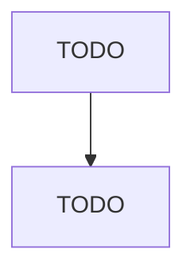

# Battery Manufacturing

> TODO: Business-as-Code definition

## Overview

This industry comprises establishments primarily engaged in manufacturing primary and storage batteries. Illustrative Examples: Disposable flashlight batteries manufacturing Dry cells, primary (e.g., AAA, AA, C, D, 9V), manufacturing Lead acid storage batteries manufacturing Lithium batteries manufacturing Rechargeable nickel-cadmium (NICAD) batteries manufacturing Watch batteries manufacturing

## Actors

| Actor | Description |
|-------|-------------|
| TODO | TODO |

## Roles

| Role | Description |
|------|-------------|
| TODO | TODO |

## Entities

| Entity | Description |
|--------|-------------|
| TODO | TODO |

## Actions

| Action | Description |
|--------|-------------|
| TODO | TODO |

## Events

| Event | Description |
|-------|-------------|
| TODO | TODO |

## Searches

| Search | Description |
|--------|-------------|
| TODO | TODO |

## Workflow

## Actor Relationships

