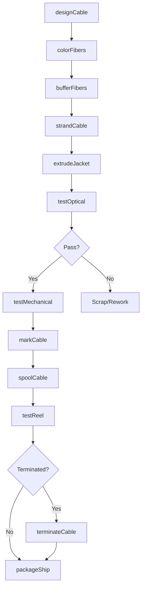
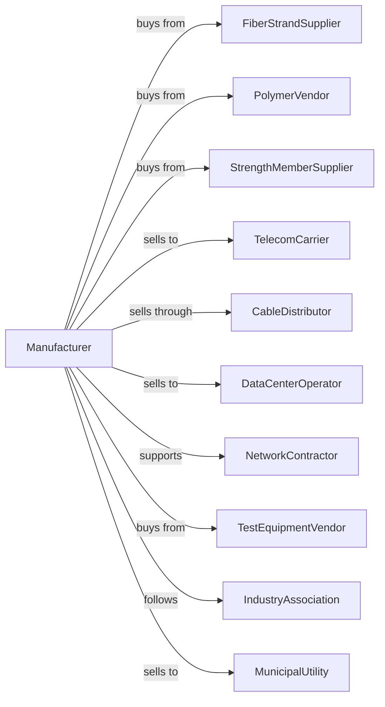

# Fiber Optic Cable Manufacturing

> Business-as-Code definition for fiber optic cable production operations. Models the complete manufacturing lifecycle from strand processing through testing and distribution.

## Overview

This U.S. industry comprises establishments primarily engaged in manufacturing insulated fiber optic cable from purchased fiber optic strand. Products include single-mode and multi-mode fiber cables for telecommunications, data centers, and industrial applications.

## Actors

| Actor | Description |
|-------|-------------|
| FiberStrandSupplier | Provides optical fiber strands |
| PolymerVendor | Supplies jacketing and buffer materials |
| StrengthMemberSupplier | Provides aramid yarns and steel wires |
| TelecomCarrier | Purchases cables for network deployment |
| CableDistributor | Wholesales cables to contractors |
| DataCenterOperator | Uses cables for facility interconnects |
| NetworkContractor | Installs fiber optic infrastructure |
| TestEquipmentVendor | Provides optical test instruments |
| IndustryAssociation | Sets cable performance standards |
| MunicipalUtility | Deploys fiber for broadband networks |

## Roles

| Role | Description |
|------|-------------|
| CableDesignEngineer | Specifies cable construction and performance |
| ExtrusionOperator | Operates jacketing and buffering lines |
| StrandingOperator | Runs fiber stranding and cabling equipment |
| QualityTechnician | Tests optical and mechanical properties |
| ProductionSupervisor | Manages manufacturing operations |
| ApplicationEngineer | Supports customers with cable selection |
| LogisticsCoordinator | Manages reel inventory and shipments |

## Entities

| Entity | Description |
|--------|-------------|
| FiberStrand | Individual glass optical fiber |
| BufferTube | Protective tube surrounding fiber strands |
| StrengthMember | Aramid or steel providing tensile strength |
| Jacket | Outer protective covering |
| Cable | Complete fiber optic assembly |
| Reel | Spool containing cable for shipping |
| Connector | Termination for optical coupling |
| FiberCount | Number of strands in cable |
| Attenuation | Signal loss per unit length |
| Bandwidth | Data transmission capacity |

## Actions

| Action | Description |
|--------|-------------|
| designCable | Specify fiber count, construction, and jacket |
| colorFibers | Apply color coding to fiber strands |
| bufferFibers | Apply protective coating around fibers |
| strandCable | Combine buffer tubes with strength members |
| extrudeJacket | Apply outer protective covering |
| testOptical | Measure attenuation and bandwidth |
| testMechanical | Verify tensile strength and bend radius |
| markCable | Print identification and length markings |
| spoolCable | Wind finished cable onto reels |
| testReel | Perform final quality verification |
| terminateCable | Add connectors for plug-and-play use |
| packageShip | Prepare reels for customer delivery |
| supportInstallation | Provide technical guidance for deployment |
| traceCable | Document cable routing and connections |

## Events

| Event | Description |
|-------|-------------|
| cableDesigned | Specifications have been approved |
| fibersColored | Color coding applied |
| fibersBuffered | Protective coating complete |
| cableStranded | Core assembly finished |
| jacketExtruded | Outer covering applied |
| opticalTested | Signal performance verified |
| mechanicalTested | Physical properties verified |
| cableMarked | Identification printed |
| cableSpooled | Wound onto delivery reel |
| reelTested | Final inspection passed |
| cableTerminated | Connectors attached |
| orderShipped | Delivery dispatched to customer |
| installationSupported | Technical assistance provided |

## Searches

| Search | Description |
|--------|-------------|
| findCables | Search by fiber count, type, or application |
| getInventory | Check reel stock by product and length |
| findOrders | Retrieve orders by customer or project |
| getTestResults | Access attenuation and mechanical test data |
| findSuppliers | List vendors for fiber or materials |
| getProductionSchedule | View manufacturing queue |
| findProjects | List deployments by region or customer |
| getCertifications | Check compliance with industry standards |

## Workflow

## Actor Relationships

