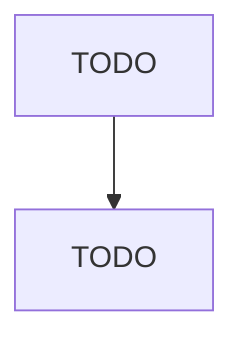

# Current-Carrying Wiring Device Manufacturing

> TODO: Business-as-Code definition

## Overview

This U.S. industry comprises establishments primarily engaged in manufacturing current-carrying wiring devices. Illustrative Examples: Bus bars, electrical conductors (except switchgear-type), manufacturing GFCI (ground fault circuit interrupters) manufacturing Lamp holders manufacturing Lightning arrestors and coils manufacturing Receptacles (i.e., outlets), electrical, manufacturing Switches for electrical wiring (e.g., pressure, pushbutton, snap, tumbler) manufacturing Cross-References. Estab

## Actors

| Actor | Description |
|-------|-------------|
| TODO | TODO |

## Roles

| Role | Description |
|------|-------------|
| TODO | TODO |

## Entities

| Entity | Description |
|--------|-------------|
| TODO | TODO |

## Actions

| Action | Description |
|--------|-------------|
| TODO | TODO |

## Events

| Event | Description |
|-------|-------------|
| TODO | TODO |

## Searches

| Search | Description |
|--------|-------------|
| TODO | TODO |

## Workflow

## Actor Relationships

