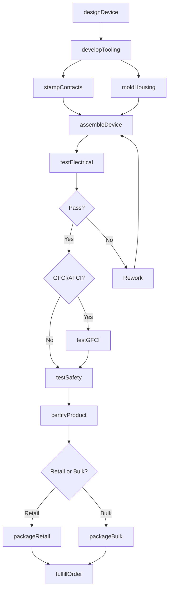
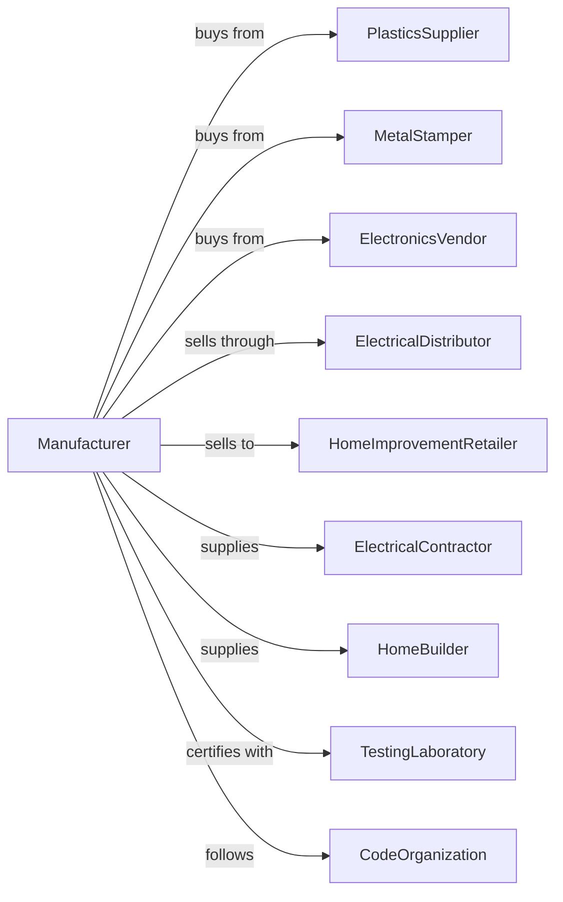

# Current-Carrying Wiring Device Manufacturing

> Business-as-Code definition for current-carrying wiring device production operations. Models the complete manufacturing lifecycle from component fabrication through distribution and installation support.

## Overview

This U.S. industry comprises establishments primarily engaged in manufacturing current-carrying wiring devices. Illustrative Examples: Bus bars, electrical conductors (except switchgear-type), manufacturing GFCI (ground fault circuit interrupters) manufacturing Lamp holders manufacturing Lightning arrestors and coils manufacturing Receptacles (i.e., outlets), electrical, manufacturing Switches for electrical wiring (e.g., pressure, pushbutton, snap, tumbler) manufacturing.

## Actors

| Actor | Description |
|-------|-------------|
| PlasticsSupplier | Provides thermoplastic housing materials |
| MetalStamper | Supplies brass and copper contact components |
| ElectronicsVendor | Provides GFCI and AFCI circuit boards |
| ElectricalDistributor | Wholesales devices to contractors |
| HomeImprovementRetailer | Sells to consumers and pros |
| ElectricalContractor | Installs devices in buildings |
| HomeBuilder | Purchases devices for new construction |
| TestingLaboratory | Provides UL and CSA certifications |
| CodeOrganization | Develops electrical installation standards |
| ImportExporter | Manages international trade |

## Roles

| Role | Description |
|------|-------------|
| ProductEngineer | Designs devices and specifications |
| ToolingEngineer | Develops molds and stamping dies |
| MoldingOperator | Runs injection molding equipment |
| AssemblyWorker | Assembles device components |
| QualityInspector | Tests electrical and mechanical function |
| PackagingOperator | Prepares products for retail display |
| ComplianceEngineer | Manages certifications and code compliance |

## Entities

| Entity | Description |
|--------|-------------|
| Receptacle | Outlet accepting plug connections |
| Switch | Device controlling circuit on/off |
| GFCI | Ground fault circuit interrupter |
| AFCI | Arc fault circuit interrupter |
| Dimmer | Device controlling light intensity |
| LampHolder | Socket for light bulb connection |
| Plug | Male connector for cord attachment |
| Connector | Device joining conductors |
| BusBar | Conductor distributing current |
| Faceplate | Cover for finished installation |

## Actions

| Action | Description |
|--------|-------------|
| designDevice | Create product specifications and drawings |
| developTooling | Design and build molds and dies |
| stampContacts | Form brass or copper contact components |
| moldHousing | Injection mold plastic enclosures |
| assembleDevice | Combine contacts, housing, and electronics |
| testElectrical | Verify proper function and ratings |
| testSafety | Perform dielectric and ground tests |
| testGFCI | Verify fault detection and trip time |
| certifyProduct | Obtain UL, CSA, or other listings |
| packageRetail | Prepare products for retail display |
| packageBulk | Prepare for contractor distribution |
| fulfillOrder | Ship products to customers |
| updateCatalog | Maintain product information and pricing |
| trainContractors | Educate installers on proper use |

## Events

| Event | Description |
|-------|-------------|
| deviceDesigned | Product specifications approved |
| toolingDeveloped | Molds and dies ready for production |
| contactsStamped | Metal components formed |
| housingMolded | Plastic parts produced |
| deviceAssembled | Product fully built |
| electricalTested | Function verified |
| safetyTested | Dielectric tests passed |
| gfciTested | Fault protection verified |
| productCertified | Safety listing obtained |
| retailPackaged | Display packaging complete |
| bulkPackaged | Contractor packaging complete |
| orderFulfilled | Shipment dispatched |
| catalogUpdated | Product data refreshed |

## Searches

| Search | Description |
|--------|-------------|
| findDevices | Search by type, amperage, or color |
| getInventory | Check stock by SKU and warehouse |
| findOrders | Retrieve orders by customer or product |
| getCertifications | List products by UL or CSA status |
| findDistributors | List wholesalers by region |
| getProductSpecs | Access technical specifications |
| findNewProducts | List recent product introductions |
| getCodeRequirements | Check NEC requirements by application |

## Workflow

## Actor Relationships

