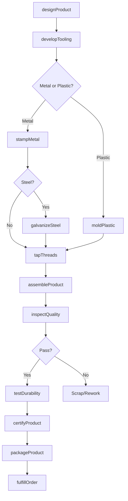
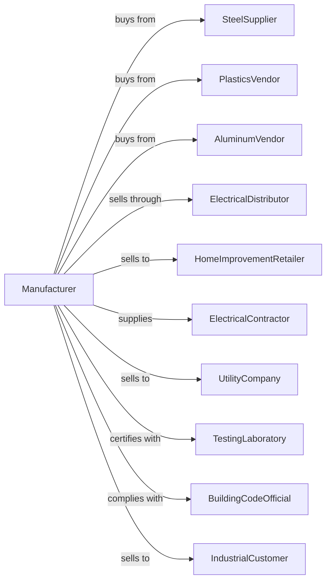

# Noncurrent-Carrying Wiring Device Manufacturing

> Business-as-Code definition for noncurrent-carrying wiring device production operations. Models the complete manufacturing lifecycle from fabrication through distribution.

## Overview

This U.S. industry comprises establishments primarily engaged in manufacturing noncurrent-carrying wiring devices. Illustrative Examples: Boxes, electrical wiring (e.g., junction, outlet, switch), manufacturing Conduits and fittings, electrical, manufacturing Face plates (i.e., outlet or switch covers) manufacturing Transmission pole and line hardware manufacturing.

## Actors

| Actor | Description |
|-------|-------------|
| SteelSupplier | Provides galvanized steel for boxes and conduit |
| PlasticsVendor | Supplies PVC and thermoplastic materials |
| AluminumVendor | Provides die-cast aluminum components |
| ElectricalDistributor | Wholesales products to contractors |
| HomeImprovementRetailer | Sells to consumers and professionals |
| ElectricalContractor | Installs boxes, conduit, and fittings |
| UtilityCompany | Purchases pole and line hardware |
| TestingLaboratory | Provides UL and NEMA certifications |
| BuildingCodeOfficial | Enforces installation requirements |
| IndustrialCustomer | Uses products in facility construction |

## Roles

| Role | Description |
|------|-------------|
| ProductEngineer | Designs boxes, fittings, and hardware |
| ToolingEngineer | Develops stamping dies and molds |
| PressOperator | Runs metal stamping equipment |
| MoldingOperator | Operates plastic injection molding |
| AssemblyWorker | Assembles components and hardware |
| QualityInspector | Verifies dimensions and finish quality |
| PackagingOperator | Prepares products for shipping |

## Entities

| Entity | Description |
|--------|-------------|
| JunctionBox | Enclosure for wire connections |
| OutletBox | Box housing receptacle or switch |
| Conduit | Tube protecting electrical wiring |
| ConduitFitting | Connector, coupling, or elbow for conduit |
| Faceplate | Cover for electrical box opening |
| PoleHardware | Brackets and clamps for utility poles |
| CableClamp | Device securing cables to boxes |
| Knockout | Removable disc for conduit entry |
| Bushing | Protective insert for cable entry |
| Cover | Lid for junction or device box |

## Actions

| Action | Description |
|--------|-------------|
| designProduct | Create specifications and engineering drawings |
| developTooling | Build dies for stamping and forming |
| stampMetal | Form steel or aluminum components |
| moldPlastic | Injection mold PVC or thermoplastic parts |
| galvanizeSteel | Apply corrosion-resistant coating |
| assembleProduct | Combine components as needed |
| tapThreads | Add threaded holes for fittings |
| inspectQuality | Verify dimensions and finish |
| testDurability | Perform crush and impact testing |
| certifyProduct | Obtain UL, CSA, or NEMA ratings |
| packageProduct | Prepare for retail or bulk shipment |
| fulfillOrder | Ship products to customers |
| updateCatalog | Maintain product listings and pricing |
| supportSpecification | Assist engineers with product selection |

## Events

| Event | Description |
|-------|-------------|
| productDesigned | Specifications approved |
| toolingDeveloped | Dies and molds ready |
| metalStamped | Steel components formed |
| plasticMolded | PVC parts produced |
| steelGalvanized | Corrosion protection applied |
| productAssembled | Components combined |
| threadsTapped | Threaded holes added |
| qualityInspected | Dimensions verified |
| durabilityTested | Impact testing complete |
| productCertified | Safety ratings obtained |
| productPackaged | Ready for shipment |
| orderFulfilled | Delivery dispatched |
| catalogUpdated | Product data refreshed |

## Searches

| Search | Description |
|--------|-------------|
| findBoxes | Search by size, depth, or gang count |
| findConduit | Search by trade size or material |
| findFittings | Search by type and conduit size |
| getFaceplates | List covers by gang and color |
| getInventory | Check stock by product and location |
| findOrders | Retrieve orders by customer |
| getCertifications | List products by rating |
| getProductSpecs | Access dimensional drawings |

## Workflow

## Actor Relationships

