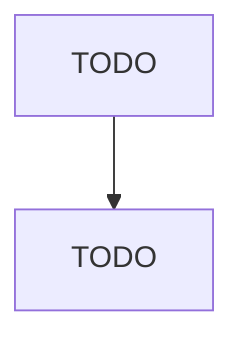

# Noncurrent-Carrying Wiring Device Manufacturing

> TODO: Business-as-Code definition

## Overview

This U.S. industry comprises establishments primarily engaged in manufacturing noncurrent-carrying wiring devices. Illustrative Examples: Boxes, electrical wiring (e.g., junction, outlet, switch), manufacturing Conduits and fittings, electrical, manufacturing Face plates (i.e., outlet or switch covers) manufacturing Transmission pole and line hardware manufacturing Cross-References. Establishments primarily engaged in--

## Actors

| Actor | Description |
|-------|-------------|
| TODO | TODO |

## Roles

| Role | Description |
|------|-------------|
| TODO | TODO |

## Entities

| Entity | Description |
|--------|-------------|
| TODO | TODO |

## Actions

| Action | Description |
|--------|-------------|
| TODO | TODO |

## Events

| Event | Description |
|-------|-------------|
| TODO | TODO |

## Searches

| Search | Description |
|--------|-------------|
| TODO | TODO |

## Workflow

## Actor Relationships

