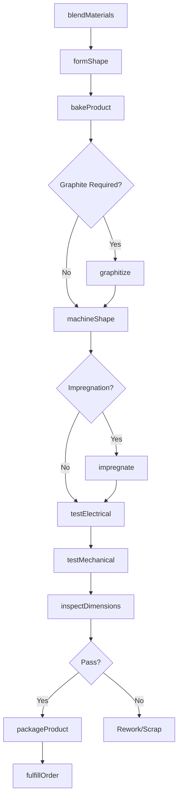
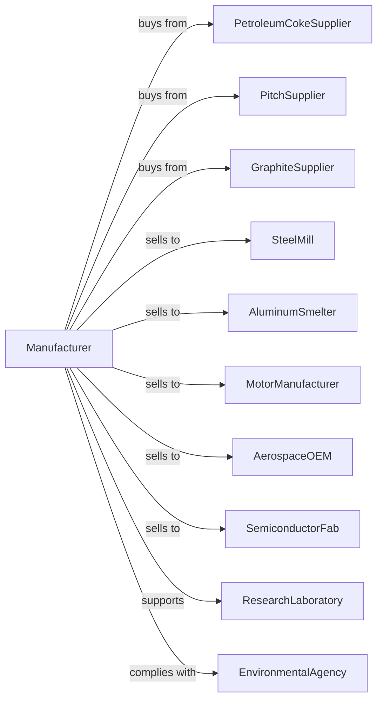

# Carbon and Graphite Product Manufacturing

> Business-as-Code definition for carbon and graphite product production operations. Models the complete manufacturing lifecycle from raw material processing through application support.

## Overview

This U.S. industry comprises establishments primarily engaged in manufacturing carbon, graphite, and metal-graphite brushes and brush stock; carbon or graphite electrodes for thermal and electrolytic uses; carbon and graphite fibers; and other carbon, graphite, and metal-graphite products.

## Actors

| Actor | Description |
|-------|-------------|
| PetroleumCokeSupplier | Provides calcined petroleum coke |
| PitchSupplier | Supplies coal tar pitch binder |
| GraphiteSupplier | Provides natural and synthetic graphite |
| SteelMill | Purchases electrodes for arc furnaces |
| AluminumSmelter | Uses anodes for electrolysis |
| MotorManufacturer | Buys brushes for electric motors |
| AerospaceOEM | Uses carbon fiber composites |
| SemiconductorFab | Purchases graphite components |
| ResearchLaboratory | Uses specialty carbon products |
| EnvironmentalAgency | Regulates emissions and waste |

## Roles

| Role | Description |
|------|-------------|
| MaterialsEngineer | Develops carbon and graphite formulations |
| ProcessEngineer | Designs manufacturing methods |
| MixingOperator | Prepares carbon compound batches |
| BakingOperator | Operates high-temperature furnaces |
| MachiningTechnician | Machines finished graphite shapes |
| QualityEngineer | Tests electrical and mechanical properties |
| ApplicationEngineer | Supports customer technical requirements |

## Entities

| Entity | Description |
|--------|-------------|
| Electrode | Carbon or graphite conductor for arc furnaces |
| Brush | Carbon component conducting current in motors |
| Anode | Carbon electrode for electrolytic cells |
| GraphiteFiber | Carbon fiber for composites |
| GraphiteBlock | Solid graphite for machining |
| CarbonPaste | Mixture of carbon and binder |
| Crucible | Graphite container for melting metals |
| Seal | Carbon component preventing leakage |
| Bearing | Self-lubricating carbon component |
| ThermalManagement | Graphite for heat spreading |

## Actions

| Action | Description |
|--------|-------------|
| blendMaterials | Mix carbon, graphite, and binders |
| formShape | Extrude or mold green carbon shapes |
| bakeProduct | Heat treat to carbonize binder |
| graphitize | High-temperature treatment for graphite conversion |
| machineShape | Cut and grind to final dimensions |
| impregnate | Fill pores with resin or metal |
| testElectrical | Measure resistivity and conductivity |
| testMechanical | Check strength and density |
| testPurity | Analyze for contaminants |
| inspectDimensions | Verify machined tolerances |
| packageProduct | Prepare for shipment |
| fulfillOrder | Ship products to customers |
| recycleScrap | Process manufacturing waste |
| supportApplication | Provide technical consultation |

## Events

| Event | Description |
|-------|-------------|
| materialsBlended | Carbon mixture prepared |
| shapeFormed | Green product molded or extruded |
| productBaked | Carbonization complete |
| productGraphitized | High-temperature treatment finished |
| shapeMachined | Final dimensions achieved |
| productImpregnated | Pores filled for density |
| electricalTested | Conductivity verified |
| mechanicalTested | Strength confirmed |
| purityTested | Contamination checked |
| dimensionsInspected | Tolerances verified |
| productPackaged | Ready for delivery |
| orderFulfilled | Shipment dispatched |
| scrapRecycled | Waste processed |

## Searches

| Search | Description |
|--------|-------------|
| findElectrodes | Search by size, grade, or application |
| findBrushes | Search by motor type or dimensions |
| findGraphiteBlocks | Search by grade or size |
| getInventory | Check stock by product type |
| findOrders | Retrieve orders by customer |
| getMaterialCerts | Access material test certificates |
| findApplications | Search by industry or use case |
| getProductSpecs | Access technical data sheets |

## Workflow

## Actor Relationships

