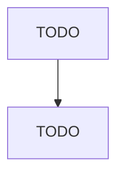

# All Other Miscellaneous Electrical Equipment and Component Manufacturing

> TODO: Business-as-Code definition

## Overview

This U.S. industry comprises establishments primarily engaged in manufacturing industrial and commercial electric apparatus and other equipment (except lighting equipment, household appliances, transformers, motors, generators, switchgear, relays, industrial controls, batteries, communication and energy wire and cable, wiring devices, and carbon and graphite products). Examples of products made by these establishments are power converters (i.e., AC to DC and DC to AC), power supplies, surge supp

## Actors

| Actor | Description |
|-------|-------------|
| TODO | TODO |

## Roles

| Role | Description |
|------|-------------|
| TODO | TODO |

## Entities

| Entity | Description |
|--------|-------------|
| TODO | TODO |

## Actions

| Action | Description |
|--------|-------------|
| TODO | TODO |

## Events

| Event | Description |
|-------|-------------|
| TODO | TODO |

## Searches

| Search | Description |
|--------|-------------|
| TODO | TODO |

## Workflow

## Actor Relationships

