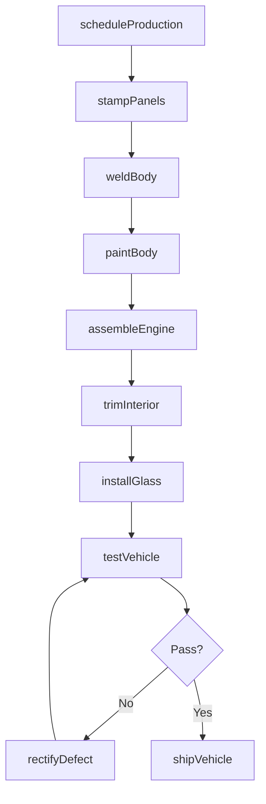
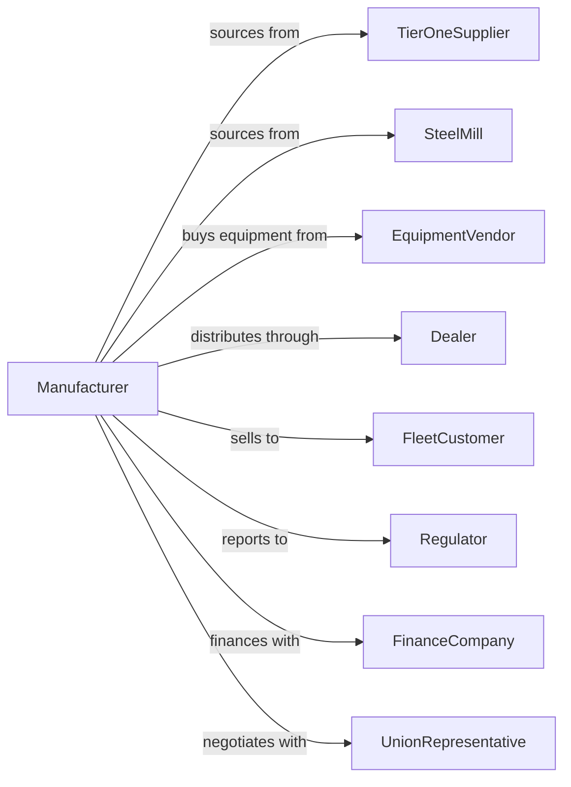

# Automobile and Light Duty Motor Vehicle Manufacturing

> Business-as-Code definition for automobile and light duty motor vehicle production. Models the complete vehicle lifecycle from design through assembly and delivery.

## Overview

This industry comprises establishments primarily engaged in manufacturing complete automobiles and light duty motor vehicles (body and chassis or unibody) or manufacturing automobile and light duty motor vehicle chassis only. Vehicles include passenger cars, light duty trucks, vans, pick-up trucks, minivans, and sport utility vehicles. Operations span design engineering, stamping, welding, painting, and final assembly with integration of thousands of components from tiered suppliers.

## Actors

| Actor | Description |
|-------|-------------|
| TierOneSupplier | Provides major systems like engines, transmissions, and seating directly to OEM |
| TierTwoSupplier | Supplies components to tier one suppliers for system integration |
| SteelMill | Provides sheet steel and specialty alloys for body panels and structural components |
| EquipmentVendor | Supplies robotics, tooling, and assembly line equipment |
| Dealer | Franchise partner that sells and services finished vehicles |
| FleetCustomer | Purchases vehicles in volume for rental, commercial, or government use |
| Regulator | Enforces safety, emissions, and fuel economy standards |
| FinanceCompany | Provides floor plan financing and consumer auto loans |
| UnionRepresentative | Represents production workers in collective bargaining |

## Roles

| Role | Description |
|------|-------------|
| PlantManager | Oversees all manufacturing operations at a production facility |
| ProductionSupervisor | Manages assembly line workers and ensures quality targets |
| QualityEngineer | Develops inspection protocols and tracks defect metrics |
| SupplyChainManager | Coordinates just-in-time delivery from hundreds of suppliers |
| ProcessEngineer | Optimizes manufacturing processes and cycle times |
| LineWorker | Performs assembly tasks at specific workstations |
| MaintenanceTechnician | Repairs and maintains production equipment and robotics |
| LogisticsCoordinator | Manages inbound parts flow and outbound vehicle shipping |

## Entities

| Entity | Description |
|--------|-------------|
| Vehicle | The complete automobile or light truck being manufactured |
| Platform | Shared architecture used across multiple vehicle models |
| BillOfMaterials | Complete list of parts and quantities for each vehicle configuration |
| ProductionOrder | Customer or dealer order specifying vehicle configuration |
| Chassis | Structural frame or unibody that supports all vehicle systems |
| Assembly | Major subassembly such as engine, transmission, or interior module |
| QualityAudit | Inspection record documenting conformance to specifications |
| VIN | Vehicle identification number uniquely identifying each unit |
| Tooling | Dies, fixtures, and molds used to manufacture specific parts |
| Shift | Scheduled production period with assigned workforce |

## Actions

| Action | Description |
|--------|-------------|
| scheduleProduction | Plan daily build sequence based on orders and material availability |
| stampPanels | Form sheet metal into body panels using dies and presses |
| weldBody | Join stamped panels into body-in-white structure |
| paintBody | Apply primer, basecoat, and clearcoat in paint shop |
| assembleEngine | Install engine, transmission, and powertrain components |
| trimInterior | Install seats, dashboard, wiring, and interior components |
| installGlass | Mount windshield, windows, and sunroof assemblies |
| testVehicle | Perform quality checks and functional testing |
| rectifyDefect | Address quality issues identified during inspection |
| shipVehicle | Transport finished vehicle to dealer or distribution center |
| trackWarranty | Monitor warranty claims and identify systemic quality issues |
| recallVehicle | Initiate safety recall for affected vehicle population |

## Events

| Event | Description |
|-------|-------------|
| productionScheduled | Build plan finalized and communicated to suppliers |
| panelsStamped | Body panels formed and ready for welding |
| bodyWelded | Body-in-white structure completed |
| bodyPainted | Paint application completed and cured |
| engineAssembled | Powertrain installation completed |
| interiorTrimmed | Interior components fully installed |
| vehicleTested | Quality inspection and road test completed |
| defectRectified | Quality issue corrected and vehicle cleared |
| vehicleShipped | Vehicle dispatched to dealer network |
| warrantyClaimFiled | Dealer submitted claim for warranty repair |
| recallIssued | Safety recall announced to affected owners |

## Searches

| Search | Description |
|--------|-------------|
| findOrders | Query production orders by dealer, region, or configuration |
| getInventory | Check work-in-progress and finished goods inventory |
| trackVehicle | Locate vehicle status throughout manufacturing process |
| findSuppliers | List suppliers by part category or commodity |
| getQualityMetrics | Retrieve defect rates, audit scores, and trends |
| checkCapacity | Query available production capacity by plant and shift |
| getWarrantyClaims | Search warranty data by vehicle, component, or symptom |

## Workflow

## Actor Relationships

