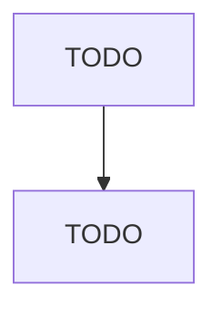

# Heavy Duty Truck Manufacturing

> TODO: Business-as-Code definition

## Overview

This industry comprises establishments primarily engaged in (1) manufacturing heavy duty truck chassis and assembling complete heavy duty trucks, buses, heavy duty motor homes, and other special purpose heavy duty motor vehicles for highway use or (2) manufacturing heavy duty truck chassis only. Cross-References. Establishments primarily engaged in--

## Actors

| Actor | Description |
|-------|-------------|
| TODO | TODO |

## Roles

| Role | Description |
|------|-------------|
| TODO | TODO |

## Entities

| Entity | Description |
|--------|-------------|
| TODO | TODO |

## Actions

| Action | Description |
|--------|-------------|
| TODO | TODO |

## Events

| Event | Description |
|-------|-------------|
| TODO | TODO |

## Searches

| Search | Description |
|--------|-------------|
| TODO | TODO |

## Workflow

## Actor Relationships

