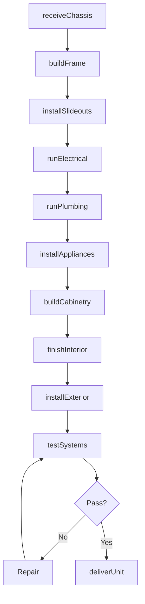
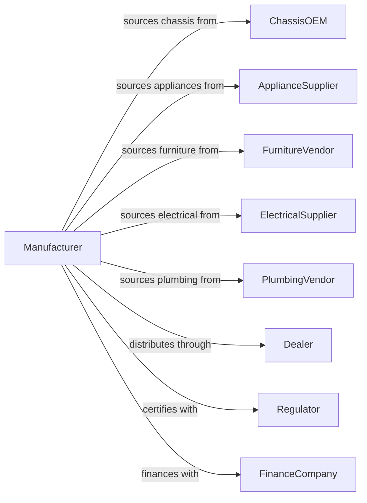

# Motor Home Manufacturing

> Business-as-Code definition for motor home and conversion van manufacturing. Models the complete production process from chassis preparation through living quarters assembly and delivery.

## Overview

This U.S. industry comprises establishments primarily engaged in manufacturing motor homes on purchased chassis and/or manufacturing conversion vans on an assembly line basis. Motor homes are units where the motor and the living quarters are integrated in the same unit. Products range from Class A diesel pushers to Class B camper vans and Class C cab-over designs, offering self-contained recreational vehicles for travel and temporary living.

## Actors

| Actor | Description |
|-------|-------------|
| ChassisOEM | Provides motorized chassis for motor home conversion |
| ApplianceSupplier | Provides refrigerators, stoves, HVAC, and water heaters |
| FurnitureVendor | Supplies seating, cabinetry, and sleeping systems |
| ElectricalSupplier | Provides electrical systems, inverters, and solar equipment |
| PlumbingVendor | Supplies water systems, tanks, and sanitation equipment |
| Dealer | Retails motor homes and provides warranty service |
| RVPark | Campground operator that hosts motor home travelers |
| FinanceCompany | Provides RV loans and extended warranties |
| Regulator | Enforces RVIA standards and vehicle safety regulations |

## Roles

| Role | Description |
|------|-------------|
| PlantManager | Oversees motor home manufacturing facility operations |
| DesignEngineer | Creates floor plans and systems integration designs |
| ProductionSupervisor | Manages assembly line teams and production flow |
| CabinetMaker | Fabricates and installs custom cabinetry and woodwork |
| ElectricalTechnician | Installs wiring, panels, and electrical systems |
| PlumbingTechnician | Installs water lines, tanks, and sanitation systems |
| InteriorFinisher | Completes upholstery, flooring, and trim work |
| QualityInspector | Performs RVIA compliance inspections and testing |

## Entities

| Entity | Description |
|--------|-------------|
| MotorHome | Complete self-propelled recreational vehicle |
| Chassis | Motorized platform from OEM for conversion |
| FloorPlan | Interior layout defining sleeping and living areas |
| Coach | Living quarters structure built on chassis |
| Slideout | Extendable room section that increases interior space |
| FreshWaterTank | Storage for potable water supply |
| HoldingTank | Gray and black water containment systems |
| Generator | Onboard power source for off-grid operation |
| Leveling | Hydraulic or electric system for stabilizing parked unit |
| Awning | Retractable exterior shade structure |

## Actions

| Action | Description |
|--------|-------------|
| receiveChassis | Accept and inspect motorized chassis from OEM |
| buildFrame | Construct coach structure and sidewalls |
| installSlideouts | Mount slideout mechanisms and room sections |
| runElectrical | Install wiring, panels, and power distribution |
| runPlumbing | Install water lines, drains, and holding tanks |
| installAppliances | Mount kitchen, HVAC, and comfort systems |
| buildCabinetry | Fabricate and install storage and furniture |
| finishInterior | Complete flooring, upholstery, and trim |
| installExterior | Add graphics, awnings, and storage compartments |
| testSystems | Verify all systems operation and leak testing |
| deliverUnit | Ship completed motor home to dealer |

## Events

| Event | Description |
|-------|-------------|
| chassisReceived | Motorized chassis accepted and staged |
| frameBuilt | Coach structure completed |
| slideoutsInstalled | Slideout mechanisms operational |
| electricalComplete | All wiring and systems connected |
| plumbingComplete | Water and waste systems installed |
| appliancesInstalled | Kitchen and comfort equipment mounted |
| cabinetryComplete | Storage and furniture installed |
| interiorFinished | All trim and finishes applied |
| exteriorComplete | Graphics and accessories installed |
| systemsTested | All systems verified functional |
| unitDelivered | Motor home shipped to dealer |

## Searches

| Search | Description |
|--------|-------------|
| findOrders | Query production orders by dealer or configuration |
| getChassisInventory | Check available chassis for production |
| trackProduction | Monitor unit progress through assembly |
| findFloorPlans | List available floor plan configurations |
| getSuppliers | Search suppliers by component category |
| findDealers | Locate dealers by region |
| getWarrantyData | Retrieve warranty claims by model or system |

## Workflow

## Actor Relationships

