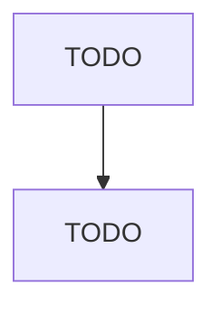

# Travel Trailer and Camper Manufacturing

> TODO: Business-as-Code definition

## Overview

This U.S. industry comprises establishments primarily engaged in one or more of the following: (1) manufacturing travel trailers and campers designed to attach to motor vehicles; (2) manufacturing pick-up coaches (i.e., campers) and caps (i.e., covers) for mounting on pick-up trucks; and (3) manufacturing automobile, utility, and light-truck trailers. Travel trailers do not have their own motor but are designed to be towed by a motor unit, such as an automobile or a light truck. Illustrative Exa

## Actors

| Actor | Description |
|-------|-------------|
| TODO | TODO |

## Roles

| Role | Description |
|------|-------------|
| TODO | TODO |

## Entities

| Entity | Description |
|--------|-------------|
| TODO | TODO |

## Actions

| Action | Description |
|--------|-------------|
| TODO | TODO |

## Events

| Event | Description |
|-------|-------------|
| TODO | TODO |

## Searches

| Search | Description |
|--------|-------------|
| TODO | TODO |

## Workflow

## Actor Relationships

