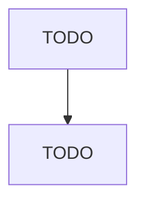

# Motor Vehicle Gasoline Engine and Engine Parts Manufacturing

> TODO: Business-as-Code definition

## Overview

This industry comprises establishments primarily engaged in (1) manufacturing and/or rebuilding motor vehicle gasoline engines and engine parts and/or (2) manufacturing and/or rebuilding carburetors, pistons, piston rings, and engine valves, whether or not for vehicular use. Illustrative Examples: Carburetors, all types, manufacturing Crankshaft assemblies, automotive and truck gasoline engine, manufacturing Cylinder heads, automotive and truck gasoline engine, manufacturing Fuel injection syste

## Actors

| Actor | Description |
|-------|-------------|
| TODO | TODO |

## Roles

| Role | Description |
|------|-------------|
| TODO | TODO |

## Entities

| Entity | Description |
|--------|-------------|
| TODO | TODO |

## Actions

| Action | Description |
|--------|-------------|
| TODO | TODO |

## Events

| Event | Description |
|-------|-------------|
| TODO | TODO |

## Searches

| Search | Description |
|--------|-------------|
| TODO | TODO |

## Workflow

## Actor Relationships

