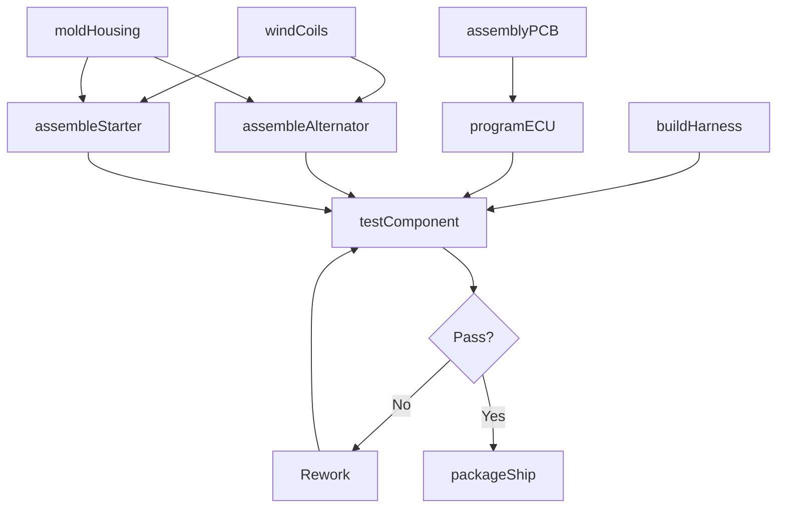
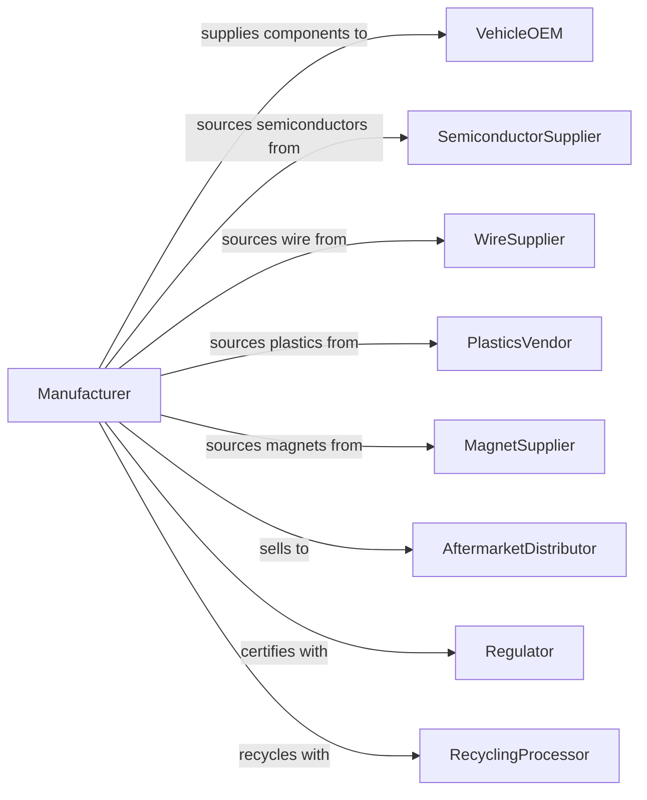

# Motor Vehicle Electrical and Electronic Equipment Manufacturing

> Business-as-Code definition for automotive electrical and electronic equipment manufacturing. Models the complete production process from component assembly through testing and delivery to vehicle manufacturers.

## Overview

This industry comprises establishments primarily engaged in manufacturing and/or rebuilding electrical and electronic equipment for motor vehicles and internal combustion engines. Products can be used for all types of transportation equipment including aircraft, automobiles, trucks, trains, and ships. Products include alternators, generators, starters, ignition systems, automotive lighting, wiring harnesses, instrument clusters, sensors, and electronic control modules.

## Actors

| Actor | Description |
|-------|-------------|
| VehicleOEM | Purchases electrical components for vehicle assembly |
| SemiconductorSupplier | Provides integrated circuits and microprocessors |
| WireSupplier | Provides copper wire, cables, and connectors |
| PlasticsVendor | Supplies housings, connectors, and insulating materials |
| MagnetSupplier | Provides permanent magnets for motors and alternators |
| AftermarketDistributor | Purchases components for replacement market |
| Regulator | Enforces safety and electromagnetic compatibility standards |
| TestEquipmentVendor | Supplies automated testing systems |
| RecyclingProcessor | Handles end-of-life electronics recycling |

## Roles

| Role | Description |
|------|-------------|
| PlantManager | Oversees electrical component manufacturing facility |
| DesignEngineer | Develops electrical and electronic component designs |
| ProductionManager | Coordinates assembly and testing operations |
| SMTOperator | Operates surface mount technology assembly equipment |
| WiringAssembler | Builds wiring harnesses and cable assemblies |
| TestTechnician | Performs functional and quality testing |
| QualityEngineer | Manages inspection and process control systems |
| SoftwareEngineer | Develops firmware for electronic control modules |

## Entities

| Entity | Description |
|--------|-------------|
| Alternator | Generator converting mechanical energy to electrical power |
| Starter | Electric motor for engine cranking |
| WiringHarness | Bundled cable assembly connecting vehicle systems |
| ECU | Electronic control unit managing vehicle subsystems |
| Sensor | Device measuring temperature, pressure, or position |
| IgnitionSystem | Components generating spark for combustion |
| Lighting | Headlamps, taillamps, and interior illumination |
| InstrumentCluster | Dashboard display assembly |
| Connector | Electrical junction device for circuit connections |
| PCB | Printed circuit board hosting electronic components |

## Actions

| Action | Description |
|--------|-------------|
| assemblyPCB | Populate printed circuit boards with components |
| windCoils | Create electromagnetic coils for motors and alternators |
| buildHarness | Assemble wiring bundles with connectors and terminals |
| moldHousing | Injection mold plastic housings and covers |
| assembleSensor | Build sensor units with transducers and electronics |
| assembleAlternator | Combine rotor, stator, and rectifier assemblies |
| assembleStarter | Build starter motor with solenoid and drive gear |
| programECU | Flash firmware and calibration to control modules |
| testComponent | Perform electrical and functional testing |
| packageShip | Package components for delivery to customer |
| rebuildUnit | Remanufacture returned cores to original specification |

## Events

| Event | Description |
|-------|-------------|
| pcbAssembled | Circuit board assembly completed |
| coilsWound | Electromagnetic coils completed |
| harnessBuilt | Wiring harness assembly completed |
| housingMolded | Plastic housings completed |
| sensorAssembled | Sensor unit completed |
| alternatorAssembled | Alternator assembly completed |
| starterAssembled | Starter motor completed |
| ecuProgrammed | Control module firmware loaded |
| componentTested | Quality testing passed |
| componentShipped | Parts delivered to customer |
| unitRebuilt | Remanufactured unit completed |

## Searches

| Search | Description |
|--------|-------------|
| findOrders | Query production orders by customer or part number |
| getInventory | Check component and finished goods inventory |
| trackProduction | Monitor parts through manufacturing stages |
| findSuppliers | List suppliers by component category |
| getTestResults | Retrieve electrical and functional test data |
| getCoreInventory | Check cores available for remanufacturing |
| getQualityMetrics | Retrieve defect rates and process capability |

## Workflow

## Actor Relationships

