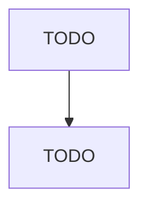

# Motor Vehicle Electrical and Electronic Equipment Manufacturing

> TODO: Business-as-Code definition

## Overview

This industry comprises establishments primarily engaged in manufacturing and/or rebuilding electrical and electronic equipment for motor vehicles and internal combustion engines. The products made can be used for all types of transportation equipment (i.e., aircraft, automobiles, trucks, trains, ships) or stationary internal combustion engine applications. Illustrative Examples: Alternators and generators for internal combustion engines manufacturing Automotive lighting fixtures manufacturing C

## Actors

| Actor | Description |
|-------|-------------|
| TODO | TODO |

## Roles

| Role | Description |
|------|-------------|
| TODO | TODO |

## Entities

| Entity | Description |
|--------|-------------|
| TODO | TODO |

## Actions

| Action | Description |
|--------|-------------|
| TODO | TODO |

## Events

| Event | Description |
|-------|-------------|
| TODO | TODO |

## Searches

| Search | Description |
|--------|-------------|
| TODO | TODO |

## Workflow

## Actor Relationships

