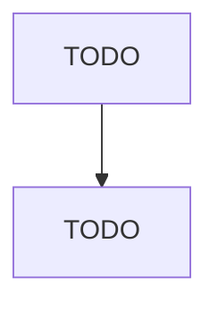

# Motor Vehicle Steering and Suspension Components (except Spring) Manufacturing

> TODO: Business-as-Code definition

## Overview

This industry comprises establishments primarily engaged in manufacturing and/or rebuilding motor vehicle steering mechanisms and suspension components (except springs). Illustrative Examples: Rack and pinion steering assemblies manufacturing Shock absorbers, automotive, truck, and bus, manufacturing Steering columns, automotive, truck, and bus, manufacturing Steering wheels, automotive, truck, and bus, manufacturing Struts, automotive, truck, and bus, manufacturing Power steering pumps manufact

## Actors

| Actor | Description |
|-------|-------------|
| TODO | TODO |

## Roles

| Role | Description |
|------|-------------|
| TODO | TODO |

## Entities

| Entity | Description |
|--------|-------------|
| TODO | TODO |

## Actions

| Action | Description |
|--------|-------------|
| TODO | TODO |

## Events

| Event | Description |
|-------|-------------|
| TODO | TODO |

## Searches

| Search | Description |
|--------|-------------|
| TODO | TODO |

## Workflow

## Actor Relationships

