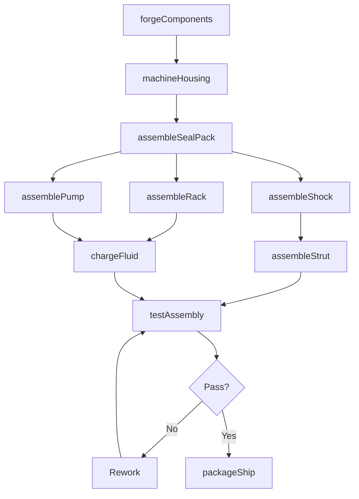
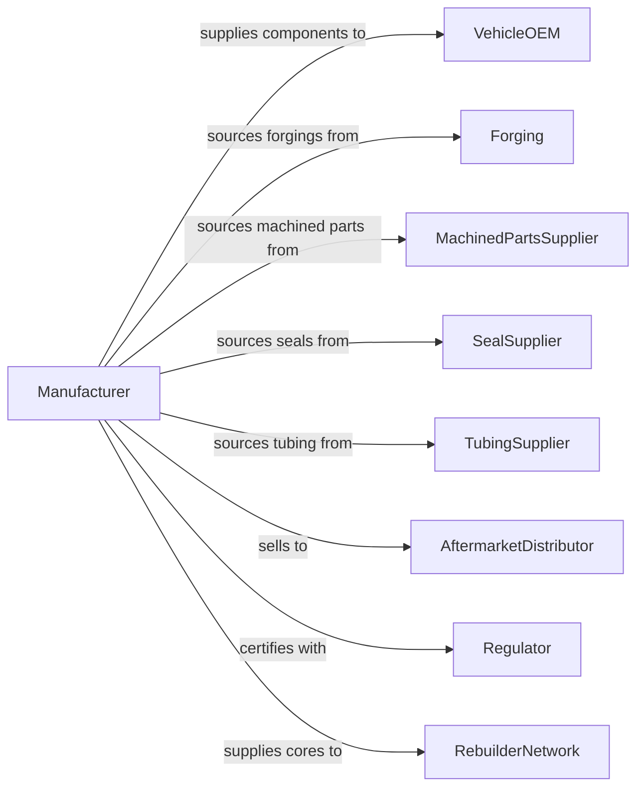

# Motor Vehicle Steering and Suspension Components (except Spring) Manufacturing

> Business-as-Code definition for steering and suspension component manufacturing. Models the complete production process from forging and machining through assembly, testing, and delivery.

## Overview

This industry comprises establishments primarily engaged in manufacturing and/or rebuilding motor vehicle steering mechanisms and suspension components (except springs). Products include rack and pinion steering assemblies, shock absorbers, steering columns, steering wheels, struts, power steering pumps, tie rod ends, ball joints, control arms, and stabilizer bars for automotive and commercial vehicle applications.

## Actors

| Actor | Description |
|-------|-------------|
| VehicleOEM | Purchases steering and suspension systems for vehicle assembly |
| Forging | Provides forged steel components for structural parts |
| MachinedPartsSupplier | Supplies precision machined components |
| SealSupplier | Provides seals and gaskets for hydraulic systems |
| TubingSupplier | Provides steel tubing for shock absorbers and struts |
| AftermarketDistributor | Purchases parts for replacement market |
| Regulator | Enforces safety and performance standards |
| TestEquipmentVendor | Supplies durability and performance testing systems |
| RebuilderNetwork | Purchases cores for remanufacturing operations |

## Roles

| Role | Description |
|------|-------------|
| PlantManager | Oversees steering and suspension manufacturing facility |
| DesignEngineer | Develops component specifications and designs |
| ProductionManager | Coordinates forging, machining, and assembly operations |
| MachinistOperator | Operates CNC equipment for precision components |
| Assembler | Builds complete steering and suspension assemblies |
| TestTechnician | Performs durability and performance testing |
| QualityEngineer | Manages inspection protocols and process control |
| MaintenanceTechnician | Maintains production equipment and tooling |

## Entities

| Entity | Description |
|--------|-------------|
| SteeringRack | Rack and pinion mechanism converting rotation to linear motion |
| ShockAbsorber | Damping device controlling suspension oscillation |
| Strut | Combined spring mount and shock absorber assembly |
| SteeringColumn | Assembly connecting steering wheel to steering gear |
| SteeringWheel | Driver interface for directional control |
| PowerSteeringPump | Hydraulic pump providing steering assist |
| TieRod | Link connecting steering gear to wheel knuckle |
| BallJoint | Spherical bearing connecting control arm to knuckle |
| ControlArm | Suspension link connecting wheel assembly to frame |
| StabilizerBar | Torsion bar reducing body roll in turns |

## Actions

| Action | Description |
|--------|-------------|
| forgeComponents | Form steel blanks into structural shapes |
| machineHousing | Precision machine gear housings and mounting surfaces |
| assembleSealPack | Build seal and bearing assemblies |
| assembleRack | Combine rack, pinion, and housing components |
| assembleShock | Build shock absorber with piston, valve, and fluid |
| assembleStrut | Combine shock, spring mount, and bearing assembly |
| assemblePump | Build power steering pump with rotor and reservoir |
| chargeFluid | Fill hydraulic components with specified fluid |
| testAssembly | Perform functional and durability testing |
| packageShip | Package components for delivery to customer |
| rebuildUnit | Remanufacture returned cores to specification |

## Events

| Event | Description |
|-------|-------------|
| componentsForged | Forged blanks completed |
| housingMachined | Gear housings machined to specification |
| sealPackAssembled | Seal assemblies completed |
| rackAssembled | Steering rack assembly completed |
| shockAssembled | Shock absorber assembly completed |
| strutAssembled | Strut assembly completed |
| pumpAssembled | Power steering pump completed |
| fluidCharged | Hydraulic systems filled and bled |
| assemblyTested | Performance testing passed |
| componentShipped | Parts delivered to customer |
| unitRebuilt | Remanufactured unit completed |

## Searches

| Search | Description |
|--------|-------------|
| findOrders | Query production orders by customer or part number |
| getInventory | Check component and finished goods inventory |
| trackProduction | Monitor parts through manufacturing stages |
| findSuppliers | List suppliers by component category |
| getTestResults | Retrieve durability and performance test data |
| getCoreInventory | Check cores available for remanufacturing |
| getQualityMetrics | Retrieve defect rates and process capability |

## Workflow

## Actor Relationships

