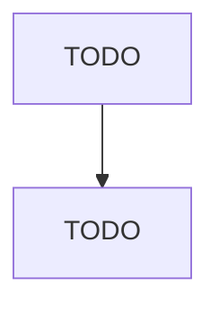

# Motor Vehicle Transmission and Power Train Parts Manufacturing

> TODO: Business-as-Code definition

## Overview

This industry comprises establishments primarily engaged in manufacturing and/or rebuilding motor vehicle transmissions and power train parts. Illustrative Examples: Automatic transmissions, automotive, truck, and bus, manufacturing Axle bearings, automotive, truck, and bus, manufacturing Constant velocity joints, automotive, truck, and bus, manufacturing Differential and rear axle assemblies, automotive, truck, and bus, manufacturing Torque converters, automotive, truck, and bus, manufacturing 

## Actors

| Actor | Description |
|-------|-------------|
| TODO | TODO |

## Roles

| Role | Description |
|------|-------------|
| TODO | TODO |

## Entities

| Entity | Description |
|--------|-------------|
| TODO | TODO |

## Actions

| Action | Description |
|--------|-------------|
| TODO | TODO |

## Events

| Event | Description |
|-------|-------------|
| TODO | TODO |

## Searches

| Search | Description |
|--------|-------------|
| TODO | TODO |

## Workflow

## Actor Relationships

