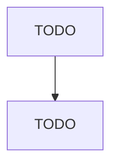

# Other Motor Vehicle Parts Manufacturing

> TODO: Business-as-Code definition

## Overview

This industry comprises establishments primarily engaged in manufacturing and/or rebuilding motor vehicle parts and accessories (except motor vehicle gasoline engines and engine parts, motor vehicle electrical and electronic equipment, motor vehicle steering and suspension components, motor vehicle brake systems, motor vehicle transmissions and power train parts, motor vehicle seating and interior trim, and motor vehicle stampings). Illustrative Examples: Air bag assemblies manufacturing Air-con

## Actors

| Actor | Description |
|-------|-------------|
| TODO | TODO |

## Roles

| Role | Description |
|------|-------------|
| TODO | TODO |

## Entities

| Entity | Description |
|--------|-------------|
| TODO | TODO |

## Actions

| Action | Description |
|--------|-------------|
| TODO | TODO |

## Events

| Event | Description |
|-------|-------------|
| TODO | TODO |

## Searches

| Search | Description |
|--------|-------------|
| TODO | TODO |

## Workflow

## Actor Relationships

