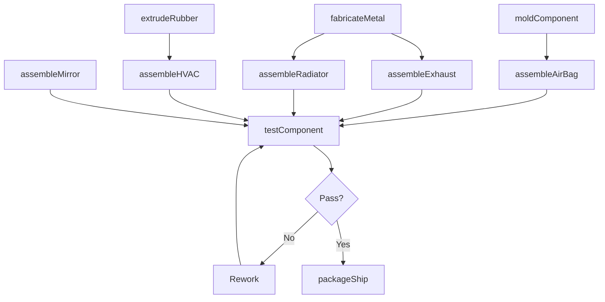
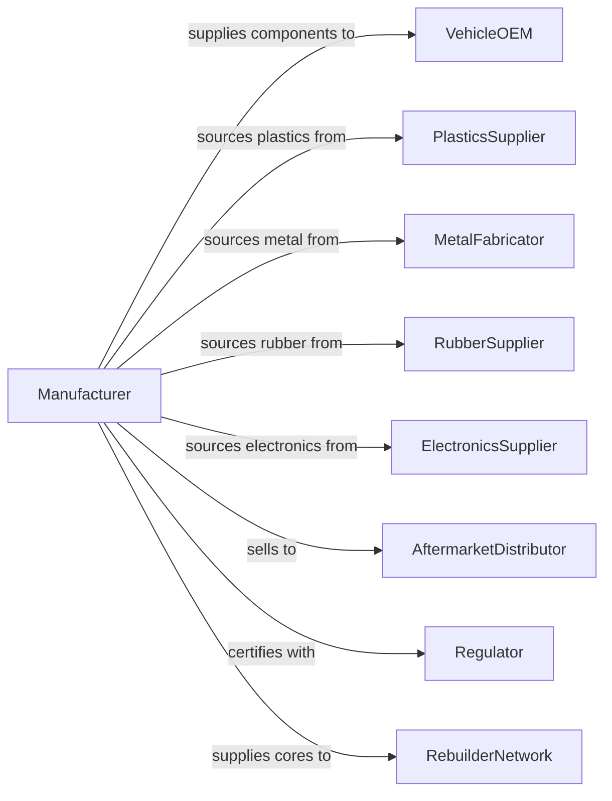

# Other Motor Vehicle Parts Manufacturing

> Business-as-Code definition for miscellaneous motor vehicle parts manufacturing. Models the complete production process from component fabrication through assembly, testing, and delivery.

## Overview

This industry comprises establishments primarily engaged in manufacturing and/or rebuilding motor vehicle parts and accessories not classified elsewhere. Products include air bag assemblies, air conditioning systems, exhaust systems, filters, fuel tanks, radiators, mirrors, windshield wiper systems, weather stripping, and other vehicle components and accessories.

## Actors

| Actor | Description |
|-------|-------------|
| VehicleOEM | Purchases components for vehicle assembly |
| PlasticsSupplier | Provides injection molded housings and components |
| MetalFabricator | Supplies stamped and formed metal parts |
| RubberSupplier | Provides seals, hoses, and weather stripping |
| ElectronicsSupplier | Supplies sensors, motors, and control modules |
| AftermarketDistributor | Purchases parts for replacement and accessory markets |
| Regulator | Enforces safety and environmental standards |
| TestLaboratory | Provides component certification testing |
| RebuilderNetwork | Purchases cores for remanufacturing |

## Roles

| Role | Description |
|------|-------------|
| PlantManager | Oversees parts manufacturing facility operations |
| DesignEngineer | Develops component specifications and designs |
| ProductionManager | Coordinates fabrication and assembly operations |
| MoldingOperator | Operates injection molding and forming equipment |
| Assembler | Builds complete component assemblies |
| TestTechnician | Performs functional and quality testing |
| QualityEngineer | Manages inspection protocols and process control |
| PackagingSpecialist | Prepares components for shipment |

## Entities

| Entity | Description |
|--------|-------------|
| AirBag | Inflatable restraint system for occupant protection |
| HVACSystem | Heating, ventilation, and air conditioning assembly |
| ExhaustSystem | Muffler, catalytic converter, and piping assembly |
| Radiator | Heat exchanger for engine cooling |
| FuelTank | Fuel storage container with pump and sending unit |
| Mirror | Interior and exterior reflective assemblies |
| WiperSystem | Windshield wiper motor and blade assembly |
| Filter | Air, oil, or fuel filtration components |
| WeatherStripping | Rubber seals for doors and windows |
| Accessory | Aftermarket enhancement or replacement component |

## Actions

| Action | Description |
|--------|-------------|
| moldComponent | Injection mold plastic housings and parts |
| fabricateMetal | Stamp, bend, and weld metal components |
| extrudeRubber | Form rubber seals and weatherstripping |
| assembleAirBag | Build inflator, bag, and housing assembly |
| assembleHVAC | Combine compressor, evaporator, and controls |
| assembleExhaust | Weld muffler, converter, and pipes |
| assembleRadiator | Build core, tanks, and mounting |
| assembleMirror | Combine glass, housing, and adjustment mechanism |
| testComponent | Perform functional and durability testing |
| packageShip | Prepare and ship components to customer |
| rebuildUnit | Remanufacture returned cores |

## Events

| Event | Description |
|-------|-------------|
| componentMolded | Plastic parts injection molded |
| metalFabricated | Metal components formed |
| rubberExtruded | Rubber seals produced |
| airBagAssembled | Air bag assembly completed |
| hvacAssembled | HVAC system assembled |
| exhaustAssembled | Exhaust system welded |
| radiatorAssembled | Radiator assembly completed |
| mirrorAssembled | Mirror assembly completed |
| componentTested | Quality testing passed |
| componentShipped | Parts delivered to customer |
| unitRebuilt | Remanufactured component completed |

## Searches

| Search | Description |
|--------|-------------|
| findOrders | Query production orders by customer or part number |
| getInventory | Check component and finished goods inventory |
| trackProduction | Monitor parts through manufacturing stages |
| findSuppliers | List suppliers by component category |
| getTestResults | Retrieve functional and durability test data |
| getCoreInventory | Check cores available for remanufacturing |
| getQualityMetrics | Retrieve defect rates and process capability |

## Workflow

## Actor Relationships

