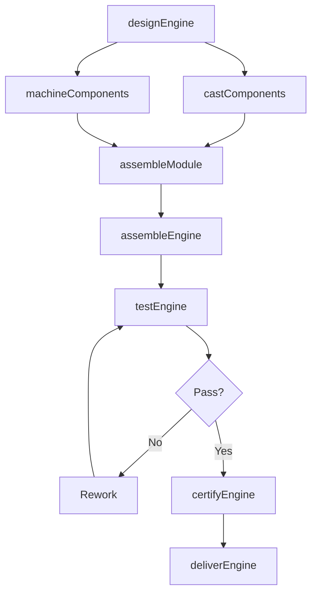
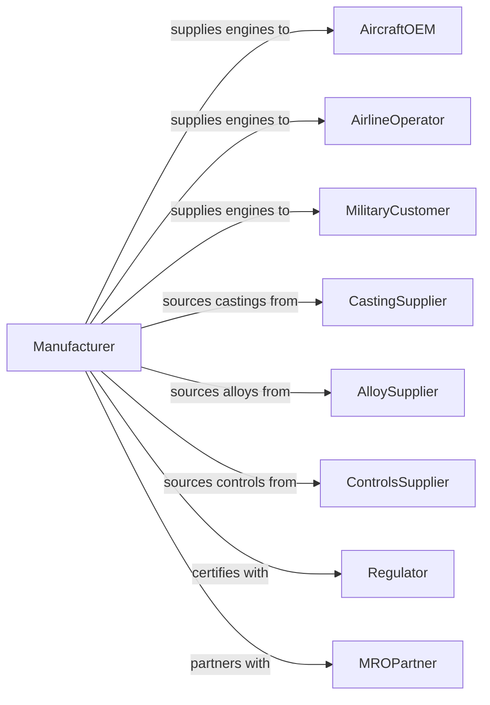

# Aircraft Engine and Engine Parts Manufacturing

> Business-as-Code definition for aircraft engine and engine parts manufacturing. Models the complete production process from design and prototyping through manufacturing, testing, and certification.

## Overview

This U.S. industry comprises establishments primarily engaged in manufacturing aircraft engines and engine parts, developing and making prototypes of aircraft engines and engine parts, aircraft propulsion system conversion involving major modifications, and aircraft propulsion systems overhaul and rebuilding. Products include turbofan engines, turboprop engines, turboshaft engines, piston engines, and engine components.

## Actors

| Actor | Description |
|-------|-------------|
| AircraftOEM | Purchases engines for installation in new aircraft |
| AirlineOperator | Acquires spare engines and orders overhauls |
| MilitaryCustomer | Procures engines for military aircraft programs |
| CastingSupplier | Provides precision cast turbine components |
| AlloySupplier | Supplies specialty metals and superalloys |
| ControlsSupplier | Provides engine control systems and sensors |
| Regulator | FAA certifying engine type design |
| MROPartner | Performs engine maintenance and overhaul |
| LeasingCompany | Provides spare engine leasing services |

## Roles

| Role | Description |
|------|-------------|
| ProgramManager | Oversees engine development and production program |
| DesignEngineer | Creates engine aerodynamic and mechanical designs |
| ProductionManager | Coordinates manufacturing and assembly operations |
| MachinistOperator | Machines precision engine components |
| Assembler | Builds engine modules and complete engines |
| TestEngineer | Plans and conducts engine test programs |
| QualityInspector | Verifies conformance to design specifications |
| OverhaulTechnician | Disassembles, inspects, and rebuilds engines |

## Entities

| Entity | Description |
|--------|-------------|
| Engine | Complete aircraft propulsion assembly |
| Compressor | Module compressing inlet air for combustion |
| Combustor | Chamber where fuel burns with compressed air |
| Turbine | Module extracting energy from hot gases |
| Fan | Large front rotor providing bypass thrust |
| GearBox | Reduction drive for propeller applications |
| FADEC | Full authority digital engine control system |
| Blade | Rotating airfoil in compressor or turbine |
| Disk | Rotor supporting blades in engine module |
| Nacelle | Aerodynamic housing enclosing engine |

## Actions

| Action | Description |
|--------|-------------|
| designEngine | Create aerodynamic and thermodynamic design |
| castComponents | Produce precision cast turbine blades and vanes |
| machineComponents | Precision machine disks, cases, and shafts |
| assembleModule | Build compressor, combustor, or turbine modules |
| assembleEngine | Combine modules into complete engine |
| testEngine | Conduct test cell performance and endurance testing |
| certifyEngine | Obtain type certificate from regulatory authority |
| deliverEngine | Ship certified engine to customer |
| overhaulEngine | Disassemble, inspect, repair, and reassemble engine |
| convertEngine | Modify engine for new application or upgrade |

## Events

| Event | Description |
|-------|-------------|
| engineDesigned | Design specifications completed |
| componentsCast | Turbine castings completed |
| componentsMachined | Precision components completed |
| moduleAssembled | Engine module completed |
| engineAssembled | Complete engine assembled |
| engineTested | Test cell program completed |
| engineCertified | Type certificate issued |
| engineDelivered | Engine shipped to customer |
| engineOverhauled | Restored engine returned to service |
| engineConverted | Modified engine certified |

## Searches

| Search | Description |
|--------|-------------|
| findOrders | Query production orders by customer or engine model |
| getInventory | Check engine and component inventory |
| trackProduction | Monitor engines through manufacturing stages |
| findSuppliers | List suppliers by component category |
| getTestData | Retrieve test cell performance data |
| getFleetStatus | Check operator engine fleet and utilization |
| getOverhaulStatus | Track engines in overhaul process |

## Workflow

## Actor Relationships

