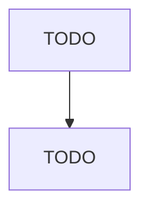

# Aircraft Engine and Engine Parts Manufacturing

> TODO: Business-as-Code definition

## Overview

This U.S. industry comprises establishments primarily engaged in one or more of the following: (1) manufacturing aircraft engines and engine parts; (2) developing and making prototypes of aircraft engines and engine parts; (3) aircraft propulsion system conversion (i.e., major modifications to systems); and (4) aircraft propulsion systems overhaul and rebuilding (i.e., periodic restoration of aircraft propulsion system to original design specifications). Cross-References.

## Actors

| Actor | Description |
|-------|-------------|
| TODO | TODO |

## Roles

| Role | Description |
|------|-------------|
| TODO | TODO |

## Entities

| Entity | Description |
|--------|-------------|
| TODO | TODO |

## Actions

| Action | Description |
|--------|-------------|
| TODO | TODO |

## Events

| Event | Description |
|-------|-------------|
| TODO | TODO |

## Searches

| Search | Description |
|--------|-------------|
| TODO | TODO |

## Workflow

## Actor Relationships

