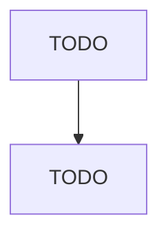

# Other Aircraft Parts and Auxiliary Equipment Manufacturing

> TODO: Business-as-Code definition

## Overview

This U.S. industry comprises establishments primarily engaged in (1) manufacturing aircraft parts or auxiliary equipment (except engines and aircraft fluid power subassemblies) and/or (2) developing and making prototypes of aircraft parts and auxiliary equipment. Auxiliary equipment includes such items as crop dusting apparatus, armament racks, inflight refueling equipment, and external fuel tanks. Cross-References.

## Actors

| Actor | Description |
|-------|-------------|
| TODO | TODO |

## Roles

| Role | Description |
|------|-------------|
| TODO | TODO |

## Entities

| Entity | Description |
|--------|-------------|
| TODO | TODO |

## Actions

| Action | Description |
|--------|-------------|
| TODO | TODO |

## Events

| Event | Description |
|-------|-------------|
| TODO | TODO |

## Searches

| Search | Description |
|--------|-------------|
| TODO | TODO |

## Workflow

## Actor Relationships

