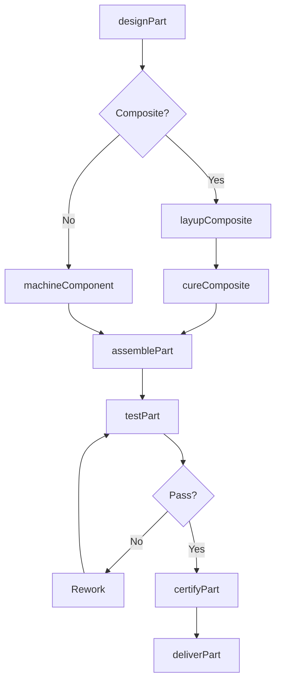
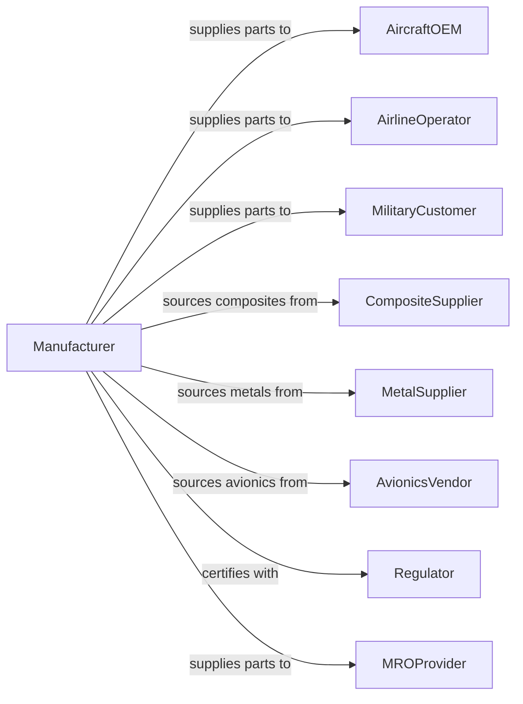

# Other Aircraft Parts and Auxiliary Equipment Manufacturing

> Business-as-Code definition for aircraft parts and auxiliary equipment manufacturing. Models the complete production process from design through fabrication, assembly, and delivery.

## Overview

This U.S. industry comprises establishments primarily engaged in manufacturing aircraft parts or auxiliary equipment (except engines and aircraft fluid power subassemblies) and/or developing and making prototypes of aircraft parts and auxiliary equipment. Auxiliary equipment includes crop dusting apparatus, armament racks, inflight refueling equipment, external fuel tanks, airstairs, and other specialized aircraft equipment.

## Actors

| Actor | Description |
|-------|-------------|
| AircraftOEM | Purchases parts for new aircraft assembly |
| AirlineOperator | Acquires spare parts and auxiliary equipment |
| MilitaryCustomer | Procures parts and equipment for defense aircraft |
| CompositeSupplier | Provides carbon fiber and composite materials |
| MetalSupplier | Supplies aluminum, titanium, and specialty alloys |
| AvionicsVendor | Provides electronic components for integration |
| Regulator | FAA certifying parts and equipment |
| MROProvider | Purchases parts for maintenance operations |
| DistributionNetwork | Stocks and distributes spare parts globally |

## Roles

| Role | Description |
|------|-------------|
| ProgramManager | Oversees parts development and production programs |
| DesignEngineer | Creates component specifications and designs |
| ProductionManager | Coordinates manufacturing and assembly operations |
| CompositeTechnician | Lays up and cures composite structures |
| Machinist | Fabricates precision metal components |
| Assembler | Builds component assemblies |
| QualityInspector | Verifies conformance to specifications |
| CertificationEngineer | Manages PMA and TSO certification processes |

## Entities

| Entity | Description |
|--------|-------------|
| AircraftPart | Component or assembly for aircraft installation |
| ControlSurface | Movable aerodynamic surface like aileron or flap |
| LandingGearComponent | Parts of takeoff and landing system |
| AuxiliaryEquipment | Specialized equipment for specific missions |
| ExternalTank | Removable fuel tank for extended range |
| RefuelingEquipment | Aerial refueling pods and receptacles |
| ArmamentRack | Mounting system for weapons and stores |
| Airstair | Integrated or portable boarding stairs |
| PMA | Parts manufacturer approval for replacement parts |
| TSO | Technical standard order authorization |

## Actions

| Action | Description |
|--------|-------------|
| designPart | Create component specifications and drawings |
| layupComposite | Build composite structures with fiber and resin |
| cureComposite | Autoclave cure composite layups |
| machineComponent | Fabricate metal parts to specification |
| assemblePart | Build complete component assemblies |
| testPart | Perform structural and functional testing |
| certifyPart | Obtain PMA or TSO authorization |
| deliverPart | Ship certified parts to customer |
| overhaualPart | Restore part to serviceable condition |
| kitEquipment | Package auxiliary equipment for installation |

## Events

| Event | Description |
|-------|-------------|
| partDesigned | Design specifications approved |
| compositeLaidUp | Composite layup completed |
| compositeCured | Autoclave cure completed |
| componentMachined | Metal fabrication completed |
| partAssembled | Assembly completed |
| partTested | Testing successfully completed |
| partCertified | Regulatory approval obtained |
| partDelivered | Parts shipped to customer |
| partOverhauled | Part restored and certified |
| equipmentKitted | Auxiliary equipment packaged |

## Searches

| Search | Description |
|--------|-------------|
| findOrders | Query production orders by customer or part number |
| getInventory | Check component and finished part inventory |
| trackProduction | Monitor parts through manufacturing stages |
| findSuppliers | List suppliers by material or component |
| getCertificationStatus | Verify PMA and TSO authorizations |
| getSparesDemand | Check customer spare parts requirements |
| getQualityMetrics | Retrieve inspection and test data |

## Workflow

## Actor Relationships

