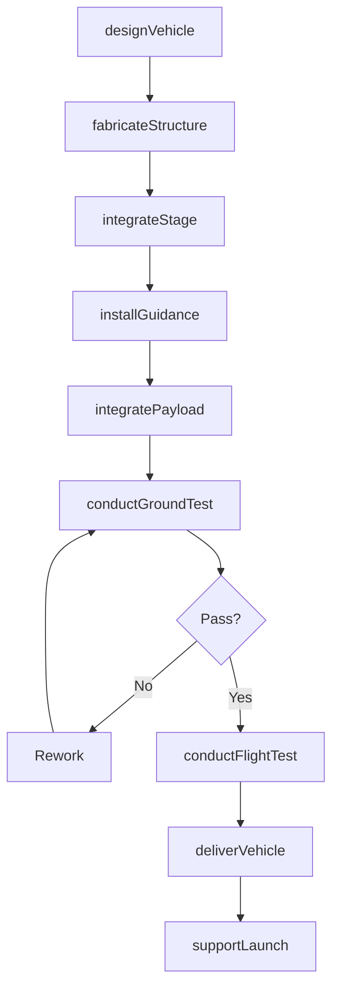
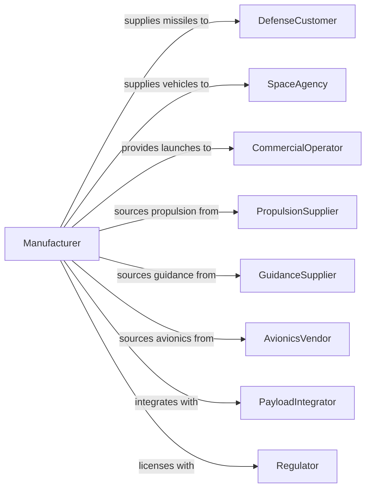

# Guided Missile and Space Vehicle Manufacturing

> Business-as-Code definition for guided missile and space vehicle manufacturing. Models the complete production process from design through integration, testing, and delivery.

## Overview

This U.S. industry comprises establishments primarily engaged in manufacturing complete guided missiles and space vehicles and/or developing and making prototypes of guided missiles or space vehicles. Products include intercontinental ballistic missiles, tactical missiles, launch vehicles, satellites, spacecraft, and space exploration vehicles.

## Actors

| Actor | Description |
|-------|-------------|
| DefenseCustomer | Military branch procuring missile systems |
| SpaceAgency | NASA or other agency procuring launch and space vehicles |
| CommercialOperator | Satellite operator purchasing launch services |
| PropulsionSupplier | Provides rocket motors and engines |
| GuidanceSupplier | Supplies inertial navigation and guidance systems |
| AvionicsVendor | Provides flight computers and control electronics |
| PayloadIntegrator | Prepares satellites and payloads for launch |
| Regulator | FAA licensing commercial launches |
| TestRange | Provides facilities for missile and launch testing |

## Roles

| Role | Description |
|------|-------------|
| ProgramManager | Oversees weapon or vehicle development program |
| SystemsEngineer | Integrates subsystems into complete vehicle |
| DesignEngineer | Creates structural and systems designs |
| ProductionManager | Coordinates manufacturing and integration operations |
| IntegrationTechnician | Assembles vehicle sections and systems |
| TestEngineer | Plans and conducts ground and flight testing |
| QualityInspector | Verifies conformance to specifications |
| LaunchDirector | Manages launch operations and countdown |

## Entities

| Entity | Description |
|--------|-------------|
| Missile | Guided weapon system with propulsion and warhead |
| LaunchVehicle | Rocket system delivering payloads to orbit |
| Spacecraft | Vehicle designed for space operations |
| Satellite | Orbital platform for communications or observation |
| Stage | Propulsion section of multi-stage launch vehicle |
| Payload | Cargo carried by launch vehicle or missile |
| Fairing | Aerodynamic shroud protecting payload during ascent |
| GuidanceSystem | Navigation and flight control electronics |
| Warhead | Explosive or specialized payload for missiles |
| GroundSupport | Equipment supporting launch and operations |

## Actions

| Action | Description |
|--------|-------------|
| designVehicle | Create overall vehicle architecture and specifications |
| fabricateStructure | Build airframe and tank structures |
| integrateStage | Assemble propulsion stage components |
| installGuidance | Mount and calibrate guidance and navigation systems |
| integratePayload | Mate payload to vehicle or fairing |
| conductGroundTest | Perform systems integration and static fire tests |
| conductFlightTest | Execute test flights for qualification |
| deliverVehicle | Transfer completed vehicle to customer |
| supportLaunch | Provide technical support for launch operations |
| refurbishHardware | Recondition reusable vehicle components |

## Events

| Event | Description |
|-------|-------------|
| vehicleDesigned | Design specifications completed |
| structureFabricated | Airframe structures completed |
| stageIntegrated | Propulsion stage assembled |
| guidanceInstalled | Navigation systems mounted |
| payloadIntegrated | Payload mated to vehicle |
| groundTestComplete | Ground testing successfully completed |
| flightTestComplete | Test flight objectives achieved |
| vehicleDelivered | Vehicle transferred to customer |
| launchSupported | Launch operations completed |
| hardwareRefurbished | Reusable components reconditioned |

## Searches

| Search | Description |
|--------|-------------|
| findOrders | Query production orders by customer or vehicle type |
| getInventory | Check vehicle and component inventory |
| trackProduction | Monitor vehicles through integration stages |
| findSuppliers | List suppliers by system or component |
| getTestData | Retrieve ground and flight test results |
| getLaunchManifest | Check scheduled launches and payloads |
| getFleetStatus | Track operational vehicle availability |

## Workflow

## Actor Relationships

