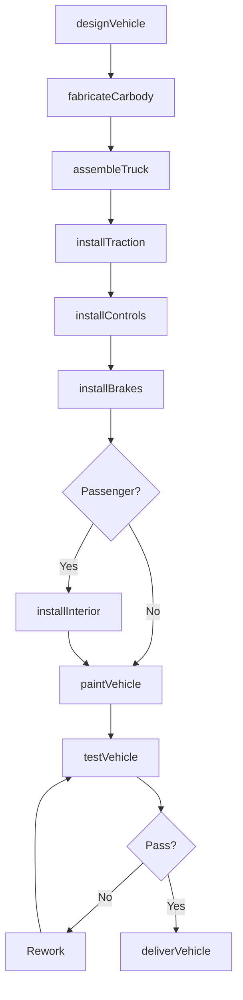
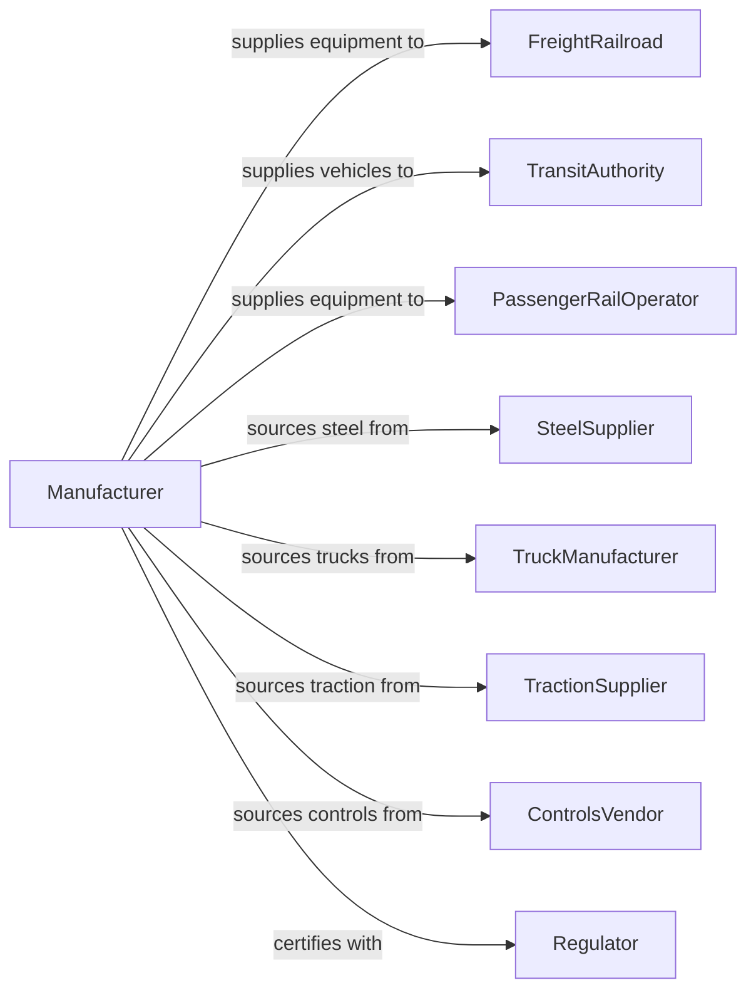

# Railroad Rolling Stock Manufacturing

> Business-as-Code definition for railroad rolling stock manufacturing. Models the complete production process from design through fabrication, assembly, and delivery.

## Overview

This industry comprises establishments primarily engaged in manufacturing and/or rebuilding locomotives, locomotive frames, and parts; manufacturing railroad, street, and rapid transit cars and car equipment for operation on rails for freight and passenger service; and manufacturing rail layers, ballast distributors, rail tamping equipment, and other railway track maintenance equipment.

## Actors

| Actor | Description |
|-------|-------------|
| FreightRailroad | Purchases locomotives and freight cars |
| TransitAuthority | Acquires passenger rail vehicles and light rail equipment |
| PassengerRailOperator | Purchases intercity passenger rail equipment |
| SteelSupplier | Provides structural steel and specialty alloys |
| TruckManufacturer | Supplies wheel and axle assemblies |
| TractionSupplier | Provides electric motors and propulsion systems |
| ControlsVendor | Supplies signaling and train control systems |
| Regulator | FRA enforcing safety and interchange standards |
| LeasingCompany | Purchases rolling stock for lease to operators |

## Roles

| Role | Description |
|------|-------------|
| ProgramManager | Oversees vehicle development and production programs |
| DesignEngineer | Creates structural and systems specifications |
| ProductionManager | Coordinates fabrication and assembly operations |
| Welder | Fabricates car body and structural components |
| ElectricalTechnician | Installs traction and control systems |
| Assembler | Builds complete vehicle assemblies |
| TestEngineer | Conducts dynamic and performance testing |
| QualityInspector | Verifies conformance to AAR and FRA standards |

## Entities

| Entity | Description |
|--------|-------------|
| Locomotive | Self-propelled rail vehicle providing motive power |
| FreightCar | Non-powered vehicle for cargo transport |
| PassengerCar | Rail vehicle designed for rider transport |
| LightRailVehicle | Self-propelled transit vehicle for urban service |
| Truck | Wheel and suspension assembly supporting car body |
| Carbody | Structural shell of rail vehicle |
| TractionMotor | Electric motor providing propulsion |
| Coupler | Device connecting rail vehicles |
| Airbrake | Pneumatic braking system |
| MaintenanceEquipment | Track maintenance machines and equipment |

## Actions

| Action | Description |
|--------|-------------|
| designVehicle | Create vehicle specifications and drawings |
| fabricateCarbody | Build structural car body and underframe |
| assembleTruck | Build wheel, axle, and suspension assemblies |
| installTraction | Mount motors and propulsion equipment |
| installControls | Mount cab equipment and train control systems |
| installInterior | Complete passenger seating and amenities |
| installBrakes | Mount air brake and braking systems |
| paintVehicle | Apply protective coating and livery |
| testVehicle | Perform static and dynamic testing |
| deliverVehicle | Ship completed vehicle to customer |
| rebuildVehicle | Overhaul and modernize existing equipment |

## Events

| Event | Description |
|-------|-------------|
| vehicleDesigned | Specifications completed and approved |
| carbodyFabricated | Structural body completed |
| truckAssembled | Running gear assemblies completed |
| tractionInstalled | Propulsion systems mounted |
| controlsInstalled | Control systems mounted |
| interiorInstalled | Passenger amenities completed |
| brakesInstalled | Braking systems mounted |
| vehiclePainted | Finish coating applied |
| vehicleTested | Testing successfully completed |
| vehicleDelivered | Rolling stock delivered to customer |
| vehicleRebuilt | Overhauled equipment returned to service |

## Searches

| Search | Description |
|--------|-------------|
| findOrders | Query production orders by customer or vehicle type |
| getInventory | Check work-in-progress and completed vehicles |
| trackProduction | Monitor vehicles through manufacturing stages |
| findSuppliers | List suppliers by component category |
| getTestData | Retrieve performance and compliance test data |
| getFleetStatus | Check operator fleet composition and condition |
| getRebuildBacklog | Query vehicles scheduled for overhaul |

## Workflow

## Actor Relationships

