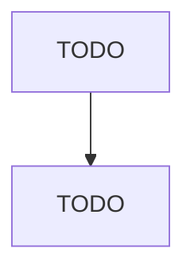

# Railroad Rolling Stock Manufacturing

> TODO: Business-as-Code definition

## Overview

This industry comprises establishments primarily engaged in one or more of the following: (1) manufacturing and/or rebuilding locomotives, locomotive frames, and parts; (2) manufacturing railroad, street, and rapid transit cars and car equipment for operation on rails for freight and passenger service; and (3) manufacturing rail layers, ballast distributors, rail tamping equipment, and other railway track maintenance equipment. Cross-References.

## Actors

| Actor | Description |
|-------|-------------|
| TODO | TODO |

## Roles

| Role | Description |
|------|-------------|
| TODO | TODO |

## Entities

| Entity | Description |
|--------|-------------|
| TODO | TODO |

## Actions

| Action | Description |
|--------|-------------|
| TODO | TODO |

## Events

| Event | Description |
|-------|-------------|
| TODO | TODO |

## Searches

| Search | Description |
|--------|-------------|
| TODO | TODO |

## Workflow

## Actor Relationships

