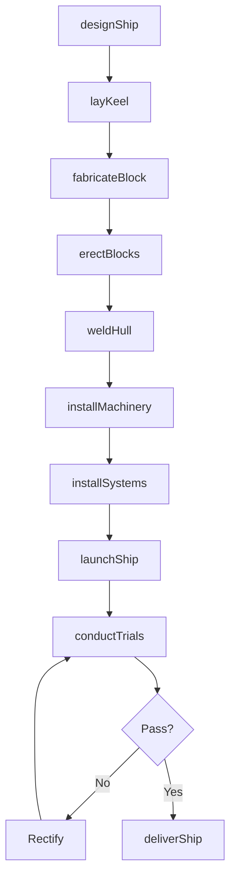
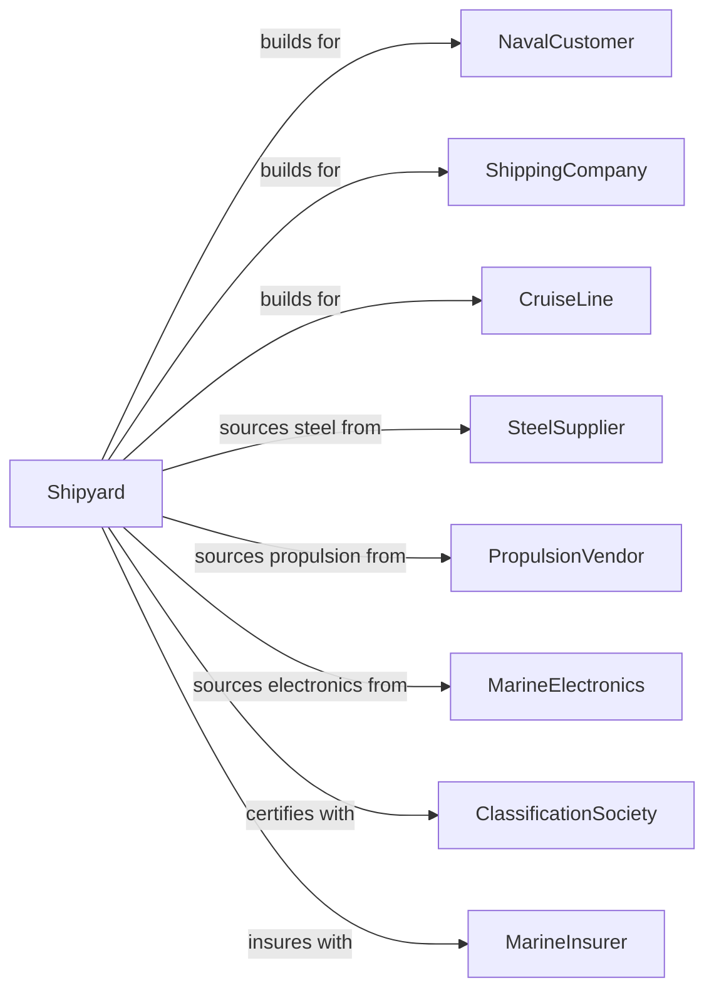

# Ship Building and Repairing

> Business-as-Code definition for shipyard operations. Models the complete ship construction and repair process from design through delivery and maintenance.

## Overview

This U.S. industry comprises establishments primarily engaged in operating shipyards. Shipyards are fixed facilities with drydocks and fabrication equipment capable of building a ship, defined as watercraft typically suitable or intended for other than personal or recreational use. Activities include ship construction, repair, conversion and alteration, production of prefabricated ship and barge sections, and specialized services such as ship scaling.

## Actors

| Actor | Description |
|-------|-------------|
| NavalCustomer | Navy or coast guard procuring military vessels |
| ShippingCompany | Commercial operator purchasing cargo vessels |
| CruiseLine | Passenger ship operator purchasing cruise vessels |
| SteelSupplier | Provides marine grade steel plate and shapes |
| PropulsionVendor | Supplies engines, shafts, and propellers |
| MarineElectronics | Provides navigation and communication systems |
| ClassificationSociety | Certifies vessel design and construction |
| PortAuthority | Provides berth and drydock facilities |
| MarineInsurer | Provides hull and cargo insurance |

## Roles

| Role | Description |
|------|-------------|
| ShipyardManager | Oversees all shipyard operations |
| NavalArchitect | Designs hull form and structural arrangements |
| MarineEngineer | Designs propulsion and ship systems |
| ProductionManager | Coordinates fabrication and assembly |
| ShipFitter | Assembles hull structure and outfitting |
| Welder | Joins steel plates and structural members |
| Pipefitter | Installs piping systems throughout vessel |
| Electrician | Installs electrical systems and wiring |

## Entities

| Entity | Description |
|--------|-------------|
| Ship | Large watercraft for commercial or military use |
| Hull | Watertight body of the vessel |
| Superstructure | Above-deck accommodations and bridge |
| Engine | Main propulsion machinery |
| Drydock | Facility for out-of-water construction and repair |
| Block | Prefabricated hull section |
| Keel | Structural backbone of the hull |
| Ballast | System controlling vessel stability |
| Outfitting | Equipment and systems installed in hull |
| Classification | Certification of vessel compliance with standards |

## Actions

| Action | Description |
|--------|-------------|
| designShip | Create hull lines, structural plans, and systems |
| layKeel | Begin hull construction with keel laying ceremony |
| fabricateBlock | Build prefabricated hull sections |
| erectBlocks | Join hull blocks in building position |
| weldHull | Complete hull welding and structure |
| installMachinery | Mount main engines and auxiliary equipment |
| installSystems | Complete piping, electrical, and HVAC |
| launchShip | Float hull for waterborne outfitting |
| conductTrials | Perform sea trials for acceptance |
| deliverShip | Transfer completed vessel to owner |
| repairShip | Perform drydock repair and maintenance |

## Events

| Event | Description |
|-------|-------------|
| shipDesigned | Design approved by owner and class |
| keelLaid | Construction officially commenced |
| blocksFabricated | Hull sections completed |
| blocksErected | Hull assembly completed |
| hullWelded | Structure completed |
| machineryInstalled | Propulsion systems mounted |
| systemsInstalled | Ship systems completed |
| shipLaunched | Hull floated from building way |
| trialsCompleted | Sea trials successfully passed |
| shipDelivered | Vessel accepted by owner |
| shipRepaired | Maintenance and repair completed |

## Searches

| Search | Description |
|--------|-------------|
| findOrders | Query construction contracts by customer or vessel type |
| getInventory | Check material and equipment inventory |
| trackConstruction | Monitor vessel progress through building stages |
| findSuppliers | List suppliers by material or equipment |
| getDrydockSchedule | Check drydock availability and bookings |
| getTrialData | Retrieve sea trial performance data |
| getRepairBacklog | Query vessels scheduled for repair |

## Workflow

## Actor Relationships

