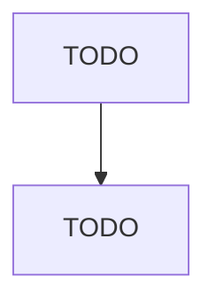

# Ship Building and Repairing

> TODO: Business-as-Code definition

## Overview

This U.S. industry comprises establishments primarily engaged in operating shipyards. Shipyards are fixed facilities with drydocks and fabrication equipment capable of building a ship, defined as watercraft typically suitable or intended for other than personal or recreational use. Activities of shipyards include the construction of ships, their repair, conversion and alteration, the production of prefabricated ship and barge sections, and specialized services, such as ship scaling. Illustrative

## Actors

| Actor | Description |
|-------|-------------|
| TODO | TODO |

## Roles

| Role | Description |
|------|-------------|
| TODO | TODO |

## Entities

| Entity | Description |
|--------|-------------|
| TODO | TODO |

## Actions

| Action | Description |
|--------|-------------|
| TODO | TODO |

## Events

| Event | Description |
|-------|-------------|
| TODO | TODO |

## Searches

| Search | Description |
|--------|-------------|
| TODO | TODO |

## Workflow

## Actor Relationships

